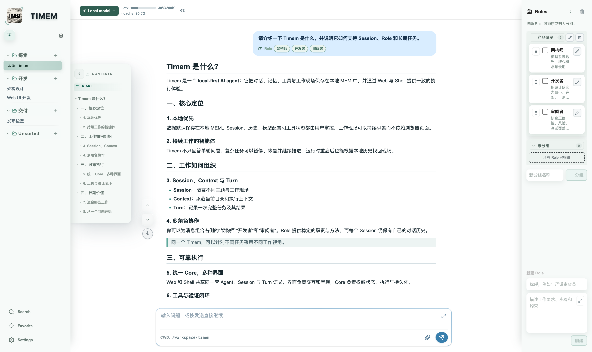

# TimemAi

TimemAi is a local-first AI agent with two interfaces:

- **`timem-web` (Recommended):** browser UI for sessions, configuration, chat
  history, tools, and live work status.
- `timem`: terminal UI for shell-heavy work.

Both interfaces use the same local runtime, memory, session history, tools, and
model service configuration.

## Install

```bash
git clone https://github.com/moliam/TimemAi.git
cd TimemAi
./install.sh
```

The installer builds and installs `timem` and `timem-web`. Cargo downloads Rust crates
automatically during the build. The released Web bundle is already included;
Node.js is only needed when developing the Web frontend.

## Quick Start — Timem Web (Recommended)

After installation, start Timem Web with one command:

```bash
timem-web
```

Timem Web opens its authenticated local page automatically. No environment
file or model credential is required just to start the UI. In the page, click
the current model name at the top left, then configure the API key, model, API
protocol, and Base URL for that Session. Send a message when the Session is
configured.

Each Session keeps its own model service configuration, so different Sessions
can use different models or endpoints without changing the others.

## Optional Environment Configuration

The Web UI is the recommended place to configure each Session. Environment
variables remain useful for terminal-first use, automation, or initial defaults
for newly created Sessions.

Create a private environment file:

```bash
cp env_template env
$EDITOR env
source ./env
```

Minimum Aliyun-compatible configuration:

```bash
export TIMEM_API_KEY=your_api_key_here
export TIMEM_MODEL=qwen-plus
export TIMEM_API_PROTOCOL=openai-compatible
export TIMEM_BASE_URL=https://dashscope.aliyuncs.com/compatible-mode/v1
export TIMEM_SPACE=.test_mem
```

The environment file can be stored elsewhere:

```bash
source /path/to/your/env
```

Use `timem --help` or `timem-web --help` to inspect available startup
options. After the first successful configuration, Timem caches the effective
runtime environment with the local Session, so later starts can resume without
re-entering it. Runtime configuration changes update that cache. Command-line
options always override cached values.

## Run Shell (Optional)

```bash
timem
```

The `source ./env` step is needed for the initial configuration or when you
intentionally select a different data root/mem space. The selected Session
restores its cached model service settings on later starts.

Example terminal session:

```text
┏━ Thought / Action ━━━━━━━━━━━━━━━━━━━━━━━━━━━━━━━━━━━━━━━┓
┃ · Checking the project status                             ┃
┃   └─ [✔] git status --short                               ┃
┗━━━━━━━━━━━━━━━━━━━━━━━━━━━━━━━━━━━━━━━━━━━━━━━━━━━━━━━━━━━┛
Timem  Done. The working tree is clean.
You ❯❯ _
```

Common controls:

- `/help`: show interactive commands.
- `/config`: change runtime settings.
- `/workspace`: manage the working directory.
- `/prof`: inspect runtime profiling.
- `Ctrl+C` or `Esc`: cancel the current input, menu, or thinking turn.
- `Ctrl+D` or `/exit`: exit the shell.

While the model is working, type an additional instruction and press Enter to
send it as a supplement to the current task.

## Timem Web Details

The Web UI provides session switching, Markdown rendering, live work updates,
attachments, runtime status, context usage, and per-session MCP tools in the
browser. Open the plug control in the header to add a local stdio, remote
Streamable HTTP, or legacy SSE MCP server and choose which Sessions may use it.
Timem Web can start without a model API key so configuration remains available
in the browser. Click the current model name to edit the selected Session. A
Session must have a valid API key before Send can start model work; the New
Session dialog also accepts Session-specific model service settings and caches
them for later starts.



Local mode binds to `127.0.0.1` and opens the authenticated page automatically
when a local graphical session is available:

```bash
timem-web
```

On SSH or headless Linux, the server prints the URL without trying to open a
browser. Open that URL on a machine with a browser.

Public mode binds to all interfaces and prints a token-protected URL:

```bash
timem-web --public
```

Open the complete URL printed in the terminal, including `?token=...`, from
your local browser. The port is selected automatically. To choose a fixed
port or advertised host:

```bash
timem-web --public --port 20699 --public-host 10.125.112.83
```

Public mode does not open a browser on the server. HTTP access may show a
browser "Not secure" warning because it uses plain HTTP; the access token is
still required. For production exposure, place Timem behind HTTPS and an
appropriate network access control layer.

## More Documentation

- [Architecture](docs/architecture.md)
- [Install and configuration](docs/install-and-configuration.md)
- [Core/UI topic protocol](docs/core-ui-topic-protocol.md)
- [Web delivery reliability contract](docs/web_reliability_test_matrix.md)
- [Capability system](docs/capability-system.md)
- [Test strategy](docs/test-strategy.md)
- [Feature and test management](docs/feature-test-management.md)
- [Release management](docs/release-management.md)
- [Release smoke checklist](docs/manual-release-smoke.md)
- [TimemAi 1.1.0 release notes](docs/release-notes-v1.1.0.md)

## Update and Uninstall

```bash
git pull --ff-only
./install.sh
```

```bash
./uninstall.sh
```

Runtime data and private environment files are user-managed and are not
removed by uninstall.

Please star [moliam/TimemAi](https://github.com/moliam/TimemAi).
