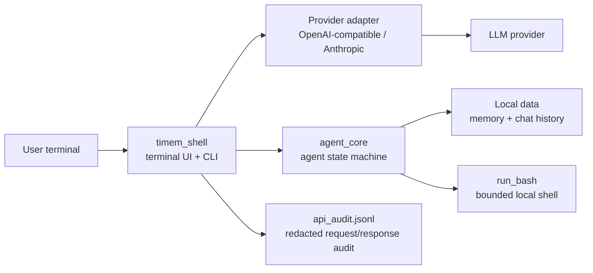
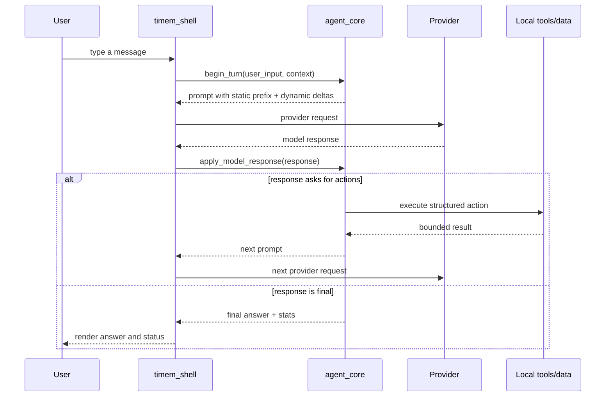
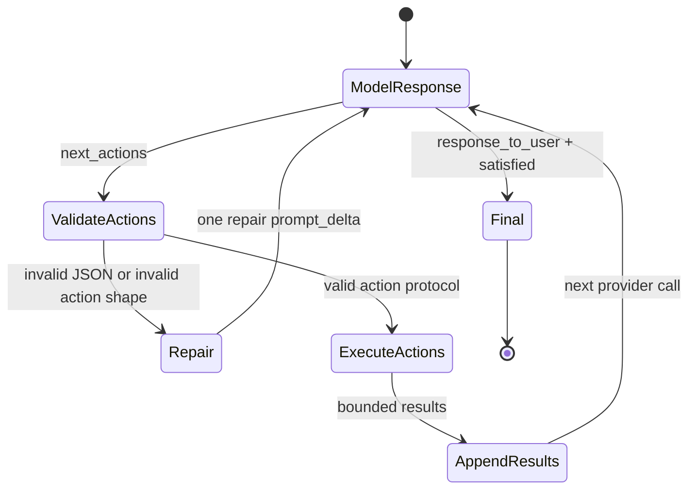
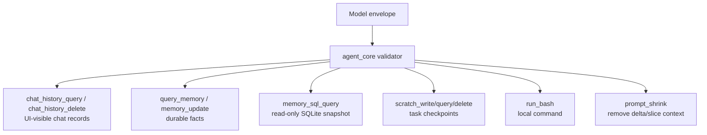

# Timem Shell Architecture

Timem Shell is a standalone Rust terminal agent. It contains the reusable agent
state machine plus a local terminal runner, provider adapters, local memory, and
bounded shell tools.

## Goals

- Keep agent behavior in Rust and independent from iOS or any cloud service.
- Let the model decide intent through explicit structured actions.
- Keep runtime responsibilities mechanical: protocol validation, persistence,
  provider IO, local command execution, and safety boundaries.
- Preserve local-first operation. API keys, audit logs, memory, and chat history
  stay on the user's machine unless the user explicitly moves them.

## Module Map



### `agent_core/`

`agent_core` owns the agent loop and is platform independent.

- Builds append-only prompt segments.
- Parses and repairs model response envelopes.
- Executes structured actions: memory reads/writes, chat-history reads,
  read-only SQL, and bounded `run_bash`.
- Tracks per-turn stats: model calls, token usage, memory reads/writes, tool
  calls, and prompt shrink counters.
- Exposes a JSON-in/JSON-out C ABI for host integrations.

### `timem_shell/`

`timem_shell` owns the terminal runtime.

- Reads CLI flags and environment config.
- Renders the shell banner, prompt, thinking block, final answer, and status
  line.
- Sends HTTP requests to providers.
- Writes local API audit logs with secret redaction.
- Loads shell history and runtime data from the selected data root.

### `resources/static_v1.json`

This is the static prompt contract visible to the model. It describes the
response envelope, tool catalog, memory layers, and safety rules. It should stay
stable because providers can cache it.

## Turn Lifecycle



Each turn can use multiple model/action rounds. The model must return exactly
one response envelope. If it emits malformed JSON or an invalid action shape,
the core sends one protocol repair request. If the repaired response is still
invalid, raw model text is blocked from the user and a safe fallback is shown.

## Prompt Concepts

Timem Shell treats prompt construction as a small event log. The model never
receives hidden runtime state; it receives dynamic prompt deltas rendered into a
sequence of prompt slices.

### Prompt Slice

A prompt slice is one rendered segment in the model-visible prompt. It is a
rendering unit:

```text
[BEGIN SEGMENT 3: prompt_delta]
delta_id: pd_1782200000000_2
slice_id: ps_1782200000000_2_s001
slice: 1/2
prompt_type: result_of_llm_action
Action result: run_bash
...
time: 1782200000000
[END SEGMENT 3: prompt_delta]
```

There are two broad rendered slice classes:

- `prompt_0`: the static prefix. It is global, stable, and cache-friendly.
- `prompt_delta`: rendered slices produced from dynamic prompt deltas.

The segment number is an ordering aid. It is not a database id and should not be
used for product logic.

`delta_id` identifies the logical prompt delta. `slice_id` identifies a specific
rendered slice inside that delta. `slice_id` is intentionally regex-friendly:

```text
^slice_id: ps_[0-9]+_[0-9]+_s[0-9]{3}$
```

Runtime shrink review and future shrink actions should use these ids:

- Use `delta_id` when a whole logical delta is stale.
- Use `slice_id` when only one rendered slice of a large delta is stale.
- Each delta has a `durable_ctx_score` from 1 to 10. The model may provide it
  in the top-level response envelope; runtime clamps it to 1..10 and otherwise
  applies a fixed default of 5. Runtime must not infer this score from natural
  language keywords such as "remember", "birthday", "不要记住", or similar
  content; semantic value belongs to the model, not the runtime. Low scores are
  better shrink candidates.
- Runtime injects long-context shrink review when observed provider input
  tokens plus the new prompt delta estimate reaches about one third of
  `TIMEM_MAX_LLM_CONTEXT`. After the first review, the next threshold advances
  by one fifth of the window. The default context window is `100K`; new prompt
  delta text that has not yet gone through the provider is estimated as roughly
  `chars / 4`.
- At 95% of the configured window, runtime marks shrink as required. The model
  should use `prompt_shrink` before continuing and preserve only the active
  work-relevant, higher-score knowledge in compact rewritten form.

### Prompt Delta

A prompt delta is a runtime-created logical increment. It is the full prompt
growth between model request N and model request N+1. One prompt delta can
contain multiple prompt slices, and those slices share one `delta_id`.

Examples of prompt slices inside a logical prompt delta:

- `user_question`: the user's new message plus small runtime context such as
  provider/model, local time, and remaining rounds.
- `result_of_llm_action`: the bounded result of a structured action requested by
  the model.
- `llm_response`: a final assistant answer already shown to the user.
- `llm_thought`: an optional private planning note emitted by the model's
  `thought` field. It is kept for continuity but never rendered to the user.

For example, one model response may add both an `llm_thought` slice and an
`llm_response` slice. They are one prompt delta with two rendered slices, not
two prompt deltas.

Prompt deltas are append-only in normal operation. Later provider requests
render the same static prefix plus all retained delta-derived slices, so the
model can see what it asked the runtime to do and what the runtime returned.

The relationship is:

```text
logical prompt stream
├── prompt_0                    static rendered slice
└── prompt_delta                dynamic logical increment
    ├── prompt_delta slice      rendered slice 1, e.g. llm_thought
    └── prompt_delta slice      rendered slice 2, e.g. llm_response
```

### Why Slices Exist

Slices make the rendered boundary explicit:

- The model can audit evidence because action results are visible in rendered
  slices derived from prompt deltas.
- The runtime can keep provider cache behavior stable by isolating `prompt_0`.
- Debug logs can identify which event introduced a piece of context.
- Protocol repair can be represented as another runtime delta instead of a
  hidden retry rule.

## Prompt Contract

Prompt rendering uses explicit segments:

```text
[BEGIN SEGMENT 0: prompt_0]
static prompt
[END SEGMENT 0: prompt_0]

[BEGIN SEGMENT 1: prompt_delta]
delta_id: pd_1782200000000_1
slice_id: ps_1782200000000_1_s001
slice: 1/1
prompt_type: user_question
...
[END SEGMENT 1: prompt_delta]
```

Important invariants:

- `prompt_0` is static global guidance only. It must not contain user input,
  runtime time, session context, API keys, or provider-specific secrets.
- Dynamic context belongs in logical prompt deltas that render as
  `prompt_delta` segments.
- Every rendered `prompt_delta` segment has `delta_id`, `slice_id`, and
  `slice: i/N` so runtime shrink review can refer to exact logical deltas or
  individual rendered slices.
- Valid dynamic prompt types are `user_question`, `result_of_llm_action`,
  `llm_response`, and `llm_thought`.
- The static prefix is sent through provider system-role/system-field support
  when available. Dynamic deltas go in the user message.
- Anthropic-protocol requests attach `cache_control: {"type": "ephemeral"}` to
  the static system block so the provider can reuse the prefix.

## Action Protocol

The model does not call Rust functions directly. It sends a response envelope.
The envelope either contains a final `response_to_user`, or a list of
`next_actions` for the runtime to execute before the next model round.



### Response Envelope

The top-level JSON object has this shape:

```json
{
  "thought": "optional private planning note",
  "response_to_user": "",
  "next_actions": [
    {
      "action": "run_bash",
      "intent": "Count Rust source lines",
      "input": {
        "command": "rg --files -g '*.rs' | xargs wc -l",
        "timeout_ms": 5000
      }
    }
  ],
  "acceptance_check": {
    "is_satisfied": false,
    "missing_info": ["line count"]
  }
}
```

`response_to_user` may be empty only when `next_actions` is non-empty.
Every action needs a top-level `intent`; the shell displays it while the action
runs. The parser also tolerates common provider drift such as a valid JSON
envelope embedded in Markdown text, but it never shows raw protocol fragments to
the user.

### Action Object

Each `next_actions` item is a structured command:

```json
{
  "action": "memory_sql_query",
  "intent": "Find recent chat messages by created time",
  "input": {
    "sql": "SELECT created_at_ms, role, content FROM chat_messages ORDER BY created_at_ms DESC",
    "limit": 20
  }
}
```

Fields:

- `action`: canonical tool name, such as `run_bash`, `chat_history_query`,
  `query_memory`, `memory_sql_query`, `memory_update`, `memory_schema`, or
  `prompt_shrink`.
- `intent`: concise human-readable reason. It is required because shell UI uses
  it as action status.
- `input`: action-specific structured parameters. Runtime validates this shape
  before executing anything.

The runtime may accept narrow compatibility aliases for older model outputs, but
new prompt and documentation should use canonical action names.

### Action Result Slice

After an action runs, `agent_core` appends a `result_of_llm_action` slice into
the current runtime increment's prompt delta. The rendered slice or slices from
that delta are the only evidence the model may claim it has seen.

Example:

```text
[BEGIN SEGMENT 5: prompt_delta]
delta_id: pd_1782200001000_4
slice_id: ps_1782200001000_4_s001
slice: 1/1
prompt_type: result_of_llm_action
Action result: memory_sql_query
rows:
- created_at_ms: 1782200000000
  role: user
  content: ...
time: 1782200001000
[END SEGMENT 5: prompt_delta]
```

The model then receives another prompt containing this result and decides
whether to answer or ask for another action.

### Protocol Repair

Provider output is untrusted. The runtime validates:

- The response is a JSON object or contains an extractable JSON envelope.
- `response_to_user` and `acceptance_check` follow the contract.
- `next_actions` is an array when present.
- Every action has `action`, `intent`, and valid `input`.
- SQL and bash actions pass their own safety checks.

If validation fails, the runtime appends one repair slice in the current runtime
increment:

```text
prompt_type: result_of_llm_action
Protocol repair request
issue: next_actions[0].intent_required
Return exactly one valid JSON object with response_to_user.
```

Only one repair round is allowed per model response failure. If the repair also
fails, the shell blocks raw model text and shows a safe fallback instead.

## Tool Surface



### Memory and Chat History

Timem separates three layers:

- Chat history: persisted user/assistant records shown in the shell transcript.
- Durable memory: long-lived user facts explicitly stored by the agent.
- Prompt deltas: current in-process context and action results.

Do not collapse these layers. A chat-history lookup is not durable memory, and
durable memory does not prove that a visible chat transcript exists.

Current implemented surface:

- Chat history search: `chat_history_query` and `memory_sql_query` over
  `chat_messages`.
- Chat history deletion: `chat_history_delete`. The SQL surface remains
  read-only and cannot delete `chat_messages`.
- Durable memory search: `query_memory` and `memory_sql_query` over `memories`.
- Durable memory insert/update/delete: `memory_update`.
- Durable memory versioning: `memory_update` snapshots `memory.jsonl` in a local
  git repository under the selected memory directory when git is available.
- Scratch notes/checkpoints: `scratch_write`, `scratch_query`, and
  `scratch_delete` over `scratch_notes.jsonl`.

### Read-only SQL

`memory_sql_query` reads a restricted SQLite surface:

- `memories(id, created_at_ms, content)`
- `chat_messages(id, session_id, turn_id, role, content, created_at_ms, source,
  profile_name, model_name, source_message_id)`

Only `SELECT`, `WITH ... SELECT`, and `PRAGMA table_info(...)` for those tables
are allowed. Write statements, DDL, SQLite metadata tables, and mismatched SQL
placeholders are rejected before execution.

### Local Shell Action

`run_bash` is for shell sessions only. It lets the model inspect or modify the
local working area when the user asks for local work and memory/chat tools are
not enough.

Current shell approval is configured at startup:

- `TIMEM_BASH_APPROVAL=ask`: ask before running bash actions.
- `TIMEM_BASH_APPROVAL=approve`: run bash actions directly.

The runtime validates structured action shape and command limits. It does not
infer the user's semantic goal from the natural-language text.

Short commands run in the foreground. Long-running commands should use
`run_bash` with `background=true` or `mode=background`. Runtime returns a
`job_id`, output file, and status file; the model then uses `shell_job_status`
to poll the job instead of repeating the long command.

### Prompt Shrink Action

`prompt_shrink` is the structured action that actually removes dynamic prompt
context. It accepts ids that came from rendered prompt slices:

```json
{
  "action": "prompt_shrink",
  "intent": "Remove stale context by id.",
  "input": {
    "delta_ids": ["pd_1782200000000_2"],
    "slice_ids": ["ps_1782200001000_4_s001"]
  }
}
```

Rules:

- `delta_ids` removes whole logical prompt deltas.
- `slice_ids` hides exact rendered slices inside a delta.
- `prompt_0` is never removable.
- Hidden slices are not rendered in later prompts and are not returned by
  prompt-delta fallback search.

## Provider Layer

Provider label and API protocol are deliberately separate:

- `TIMEM_GATEWAY_PROVIDER` selects the traffic platform and default URL.
- `TIMEM_API_PROTOCOL` selects the wire format.
- `TIMEM_MAX_LLM_CONTEXT` selects the assumed maximum model input context
  window; default is `100K`.

Supported protocols:

- `openai-compatible`
- `anthropic`

Examples:

```text
aliyun    -> OpenAI-compatible by default
openai    -> OpenAI-compatible by default
anthropic -> Anthropic by default
custom    -> set TIMEM_API_PROTOCOL and TIMEM_BASE_URL explicitly
```

`TIMEM_BASE_URL` can override the provider default. API keys are read from
environment/config and are redacted from audit logs.

## Runtime Data

By default, data is scoped to the directory where `timem-shell` starts:

```text
data/<space>/api_audit.jsonl
data/<space>/memory/
data/<space>/shell_history.txt
```

Use `TIMEM_DATA_DIR=/path/to/data` for a fixed data root.

The audit log records provider requests/responses and final turn summaries. It
is a debugging artifact, not a user-facing transcript. Secrets are redacted.

## Runtime Boundary

The runtime must not understand natural-language user semantics.

Allowed runtime behavior:

- Validate protocol shape.
- Classify and bound structured tool execution.
- Run lexical search over exact query text.
- Package evidence and tool results for the model.
- Repair malformed response envelopes.

Forbidden runtime behavior:

- Keyword-based intent routing such as detecting "昨天", "生日", or "名字".
- Semantic alias tables or hardcoded query rewrites.
- Auto-running memory/chat/shell/search prechecks based on user wording.
- Fixing one bug report by adding case-specific prompt or runtime rules.

The model owns semantic interpretation. The runtime owns state, safety,
persistence, and evidence delivery.

## Testing Strategy

The standalone shell should stay releasable with:

```bash
cargo fmt --check
cargo test --workspace
cargo build -p timem_shell --release
```

Core tests cover:

- Prompt append-only behavior and static prefix separation.
- Response-envelope repair and malformed-provider output handling.
- Memory, chat history, read-only SQL, and SQL safety.
- `run_bash` action validation and execution behavior.
- Provider config, endpoint construction, usage/cached-token parsing.
- Shell rendering contracts for thinking/final status lines.

When adding a capability, update this document, implement the code, then add or
adjust tests for the invariant being changed.
