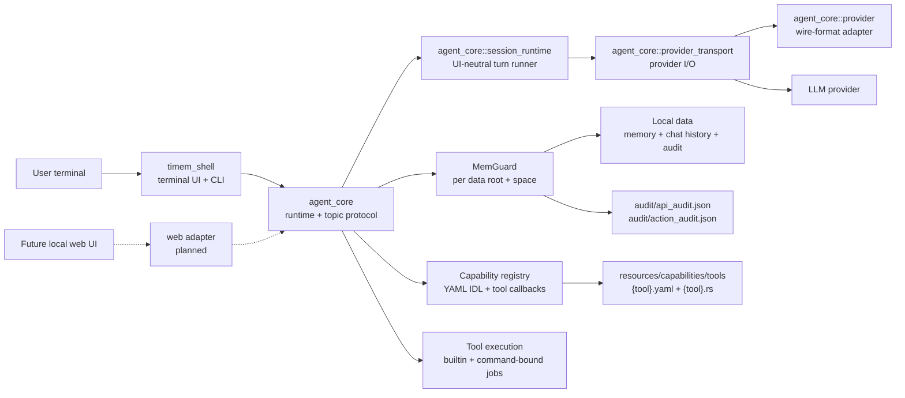
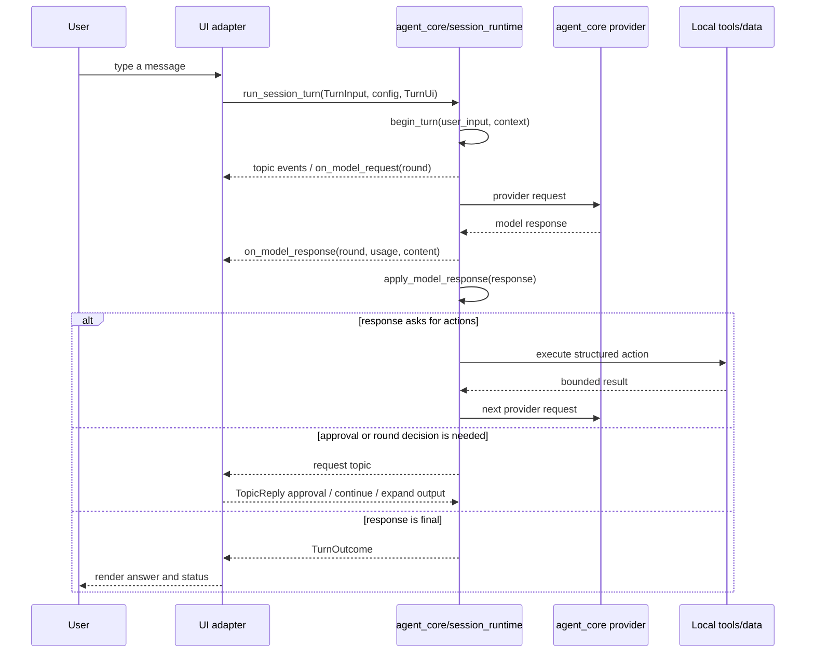
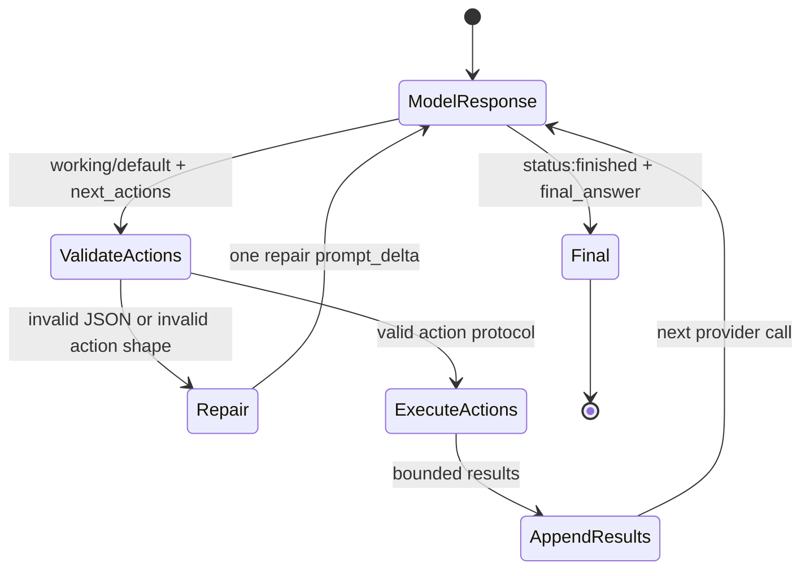
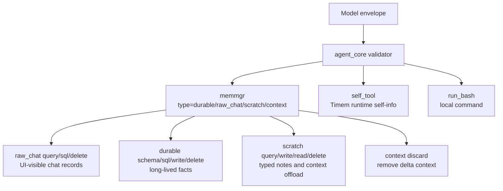

# Timem Architecture

Timem Shell is the terminal host for the reusable Timem Rust agent core. The
terminal host owns CLI/input/rendering. `agent_core` owns the reusable runtime,
provider transport, memory, model protocol parsing, capability execution, and
structured core/UI topic protocol.

## Goals

- Keep agent behavior in Rust and independent from iOS or any cloud service.
- Let the model decide intent through explicit structured actions.
- Keep runtime responsibilities mechanical: protocol validation, persistence,
  provider IO, local command execution, and safety boundaries.
- Preserve local-first operation. API keys, audit logs, memory, and chat history
  stay on the user's machine unless the user explicitly moves them.

## Module Map



### `agent_core/`

`agent_core` owns the agent loop and is platform independent.

- Provides reusable capability functions and state-machine functions. Host
  adapters call core functions instead of reimplementing agent behavior.
- Exposes state/progress through structured topic events and structured return
  values. Hosts receive `CoreTopicEvent` batches via core dispatch methods, then
  render the resulting data in their own UI style.
- Defines host-independent turn adapter helpers such as user-supplement
  normalization. A terminal, Web, or native host may collect input differently,
  but empty/whitespace supplement filtering before adding `user_supplement`
  slices is a core boundary rule.
- Returns structured output, not terminal strings. A shell, Web UI, or iOS app
  may render the same core data as ANSI text, HTML, native views, logs, or
  accessibility-friendly UI.
- Represents non-normal turn endings with structured `TurnStopReason` values
  such as cancellation, provider/model error, output-limit stop, or round-limit
  stop. Hosts may still show the fallback text, but should not infer state by
  parsing localized user-facing strings.
- Builds append-only prompt segments.
- Parses and repairs model response envelopes through
  `agent_core::response_protocol`. The parser modules are runtime code, not
  model-facing prompt resources.
- Loads capability manifests and renders the model-facing tool catalog from the
  same JSON Schema style IDL used to validate canonical tool actions.
- Renders `prompt_0` and dynamic prompt delta blocks through
  `agent_core::prompt_render`, so prompt generation is a module boundary rather
  than ad hoc string assembly in the turn loop.
- Owns provider transport in `agent_core::provider_transport`, including model
  HTTP execution, cancellation polling, request/response audit append, and
  provider response handoff.
- Owns provider wire-format construction and response parsing in
  `agent_core::provider`: OpenAI-compatible chat completions, OpenAI Responses,
  Anthropic messages, structured-output hints, endpoint joining, usage parsing,
  truncation detection, provider HTTP error normalization/redaction, provider
  default protocol/base URL/model rules, provider cache-control block
  translation, and provider request/response audit event data.
- Owns provider-agnostic prompt cache planning in `agent_core::prompt_cache`.
  The algorithm splits rendered prompt into static prompt and dynamic
  delta blocks, marks stable cache boundaries, and returns shell/UI-neutral
  data structures for host adapters to translate into provider requests.
- Owns UI-neutral profiling state in `agent_core::profiler`: per-model token
  totals, cache hit/create counters, model wait/local work timing, and storage
  size snapshots. It exposes raw `RuntimeProfileReport` data as the
  shell-independent `/prof` data shape; host adapters decide how to format
  counts, durations, percentages, units, and layout.
- Owns UI-neutral runtime configuration report data in
  `agent_core::config_report`, including effective provider/model/runtime/data
  rows and default/default-overridden semantic flags. Host adapters render this as a
  terminal startup banner, settings screen, or web panel.
- Owns UI-neutral token/status summary and view-model data in
  `agent_core::status_summary`: meaningful latest usage detection, total/latest
  token breakdowns, context percentage, progress-bar fill counts, model rounds,
  and repair counts. Host adapters choose symbols, compact number formatting,
  and layout.
- Owns the UI-neutral runtime status snapshot shape in
  `agent_core::status_view`, including structured retry status. Hosts may render
  retry countdowns, details, colors, or notifications differently, but should
  not store retry state as scattered UI strings.
- Normalizes model progress/actions into UI-neutral topic events after model
  response parsing: job progress, user-visible intent, activity state, memory
  read/write activity, and structured `CoreActionKind` values such as Bash,
  memory, capability, or self-tool activity. Core may include raw action/input
  as evidence, but hosts should render from the structured kind instead of
  parsing protocol-specific action JSON. Host adapters render these topic events
  as terminal panels, native app status, web events, or other UI-specific forms.
- Owns API audit document append/migration mechanics and UI-neutral runtime
  event builders in `agent_core::audit`. Host adapters choose audit file paths
  and decide when to append events.
- Executes structured actions through the capability registry. Built-in tool
  packages live under `resources/capabilities/tools/{tool}.yaml` plus a paired
  `{tool}.rs` callback; overlay command tools are loaded from the capability
  directory. The shell UI may provide user decisions such as approval, but
  command execution, registered tool job lifecycle, evidence shaping, and tool
  audit are core responsibilities.
- Routes memory-space file access through `MemGuard` so multiple CLI processes
  using the same data root and space do not corrupt or lose writes.
- Tracks per-turn stats: model calls, token usage, memory reads/writes, tool
  calls, and prompt shrink counters.
- Exposes a JSON-in/JSON-out C ABI for host integrations.

### `timem_shell/`

`timem_shell` owns the terminal host and UI.

- Reads CLI flags and environment config.
- Parses terminal-only user commands and maps shared commands to core functions
  where appropriate.
- Renders the shell banner, Reedline-backed input prompt, observation panel,
  final answer, profiling output, and status line.
- May provide shell-only commands for terminal user experience, such as
  `/config`, `/prof`, input recovery, or other TTY conveniences. These commands
  stay outside the model-visible capability surface when they do not require
  agent reasoning, memory actions, or tool protocol cooperation.
- Chooses local API/action audit paths and records host turn events through
  core-owned audit document writers and redaction helpers.
- Loads shell history and runtime data from the selected data root.

Key shell-side modules:

- `main.rs`: CLI, interactive loop, Reedline input adapter, config menu, paste
  placeholder recovery, cancellation handling, startup banner rendering, and
  the CLI implementation of the turn UI callbacks.
- `observation.rs`: modular Thought / Action observation events and rendering.
  It consumes `CoreTopicEvent` values instead of parsing model responses in the
  shell production path, renders user-facing intent as top-level `·` rows, and
  renders `CoreActionKind` values as concrete Bash/memory/context activity child
  rows using `├─`/`└─` prefixes.
- thinking status hints use `agent_core::topic_event_status_hint`; shell only
  maps the returned memory activity to a terminal marker.
- `profiler.rs`: shell rendering for `/prof` from `RuntimeProfileReport`;
  profiling state, report data generation, and storage collection live in
  `agent_core::profiler`.
- startup/config rendering uses `RuntimeConfigReport` from
  `agent_core::config_report`; shell owns keyboard menus and table drawing.

Host-specific commands are acceptable when they are purely presentation or
adapter ergonomics. If a feature must be visible to the model, callable by the
model, shared by iOS/Web/CLI, or reflected in prompt/capability contracts, it
belongs in `agent_core` or `resources` instead of being implemented as a
shell-only shortcut.

In short:

```text
agent_core:
  - reusable fn() capability/state APIs
  - CoreTopicEvent-style structured topic protocol
  - structured outputs and structured decisions
  - model protocol parsing, provider request preparation, memory/tools

UI host:
  - render(structured_output)
  - parse UI gestures/commands and call core fn()
  - implement UI-only functions such as shell-only slash commands
  - own terminal/web/native layout, strings, colors, key handling, and host IPC
  - do not implement provider/model transport or model-requested tool execution
```

Do not over-centralize UI concerns into core. Core should expose data, abstract
process state, reusable operations, and structured topic events. Each host
keeps freedom to present that data differently and to implement host-only
ergonomics when they do not become shared model-visible capability.

### `resources/`

`resources/` owns model-facing prompt materials and capability manifests.
`agent_core/src` owns runtime structures, executable response parsers, provider
wire-format adapters, and executors. It should not contain system prompt text or
protocol prompt prose.

- `resources/system_prompt/system_prompt.md`: Markdown static prompt shell.
  It is the stable model-visible outer contract and contains placeholders for
  protocol and capability injection.
- `resources/protocol/markdown/`: Markdown response protocol prompt
  injection and schema summary.
- `resources/protocol/json/`: JSON response protocol prompt injection, schema
  summary.
- `resources/protocol/xml/`: XML response protocol prompt injection, schema
  summary.
- `scripts/update_static_prompt_snapshot.sh`: one-shot expanded prompt generator
  for human review. Generated files are written under `target/` by default and
  are not checked into the repository.
- `resources/capabilities/tools/*.yaml`: tool capability manifests. The same
  manifest data renders the model-facing tool catalog and validates parsed
  action arguments before execution.

The literal `{{TOOL_CATALOG}}` placeholder in this file is not the long-term
source of truth. At runtime, `agent_core` replaces it with a catalog generated from built-in
`resources/capabilities/tools/*.yaml` manifests plus an optional
`TIMEM_CAPABILITIES_DIR` overlay. See
[`docs/capability-system.md`](capability-system.md).

## Response Protocol Suites

Timem separates model-facing protocol instructions from runtime parsing:

```text
resources/protocol/<suite>/
├─ response_protocol.md          model-facing instructions injected into prompt_0
└─ response_schema_summary.*     compact schema summary injected by prompt render

agent_core/src/response_protocol/
├─ mod.rs                        protocol-independent ParsedEnvelope/ParsedAction
├─ markdown_suite.rs             Markdown response parser and repair policy
├─ json_suite.rs                 JSON response parser and repair policy
└─ xml_suite.rs                  XML response parser and repair policy
```

The `resources/protocol/<suite>` files are model-facing prompt resources and
review snapshots. The Rust modules under `agent_core/src/response_protocol/`
are executable parser suites. They intentionally live in code because they
define runtime behavior, repair boundaries, and tests; they must stay aligned
with the resource text and generated expanded prompt output from
`scripts/update_static_prompt_snapshot.sh`.

The XML suite uses `quick-xml` to parse the outer response tree. Runtime control
sections are only read from direct children of the root `<response>` node.
Display-text fields such as `<final_answer>` and `<free_talk>` are treated as
opaque text, so XML examples inside those fields are not re-parsed as actions.
Nested XML-looking text in those fields preserves element attributes and
self-closing tags when it is carried forward as display/context text.

The selected suite is controlled by `TIMEM_RESPONSE_PROTOCOL` or
`--response-protocol`. The default is `xml`; `markdown` and `json` remain
available. All suites must produce the same internal `ParsedEnvelope` semantics
for the same user-visible capability: status/final answer, progress, free_talk
retention, actions, and `context_compact`.

The prompt must not tell the model that multiple suites exist. It should only
show the currently selected response protocol. This keeps provider-facing text
small and avoids making runtime implementation choices part of the user's task.

Markdown protocol recovery is intentionally bounded:

- If the model emits a natural-language preface before a valid Markdown
  protocol section, the parser may recover from the first recognized protocol
  heading such as `## Status`, `## Progress`, `## Final_Answer`,
  `## Working_Still_Action`, or `## Context Compact`.
- A standalone fenced `action` block is treated as working protocol output.
- Ordinary Markdown headings such as `## Notes` are not protocol. They remain a
  plain final answer unless they contain JSON/action-looking syntax that should
  trigger repair.
- Malformed action blocks are never downgraded to a final answer. They produce
  a protocol repair slice so the model can correct the response.

JSON protocol recovery is similarly bounded around explicit JSON-looking
content. It may strip fences or extract a balanced JSON object, but it must not
guess actions from ordinary prose.

When changing one suite, add or update parity tests so `json` and `markdown`
continue to map equivalent protocol content to equivalent `ParsedEnvelope`
values. Parser tolerance can differ at the syntax edge, but executable
capability semantics must not.

## Turn Lifecycle



Each turn can use multiple model/action rounds. The model must return exactly
one response envelope. If it emits malformed JSON or an invalid action shape,
the core sends one protocol repair request. If the repaired response is still
invalid, raw model text is blocked from the user and a safe fallback is shown.

The UI adapter must not own the agent loop, provider transport, or tool
execution. Its responsibilities are limited to:

- Present turn progress events such as model request/response and observations.
- Provide user decisions for approvals, round-limit continuation, stale context,
  and output-token expansion when the UI is interactive.
- Provide cancellation state.
- Render `TurnOutcome`.

The boundary is intentionally structural, not visual. `agent_core` should expose
semantic data, events, and operations; it should not decide terminal colors,
line wrapping, prompt widgets, web animations, iOS layouts, or other
presentation details. Each host UI may render the same structured core output in
its own way and may add host-only commands or interactions that improve that
environment, as long as they do not fork or reimplement the core agent loop.

Non-interactive callers should use `NoopTurnUi`, whose defaults deny approvals,
do not continue round limits, do not request output expansion, and do not
require terminal state.

## Host Adapter Boundary and iOS Readiness

`agent_core` is the reusable agent engine. It must remain free of terminal UI
dependencies such as Reedline, Crossterm, ANSI rendering, prompt menus, or
terminal input handling. Host integrations should treat it as a state machine:

- call `run_session_turn` or lower-level core functions with user input and
  host-provided supporting context
- render topic events and structured outcomes
- reply to core-originated request topics
- signal cancellation and supply optional user supplements

The terminal app is one host adapter. iOS should be another host adapter, not a
fork of the agent loop. The iOS path should reuse `agent_core` through the
existing JSON-in/JSON-out C ABI or a thin generated binding, then implement only
iOS-specific pieces outside the core:

- native UI rendering and input
- user approval prompts
- local shell bridge selection and transport
- platform-specific audit and data-directory wiring

Host adapter request/outcome/UI callback traits live in `agent_core::host`.
Those traits are semantic contracts, not a terminal UI framework: a shell,
iOS, or Web host can implement the same callbacks and render the structured
events in its own style. User decision callbacks also use structured request
types, such as `RoundLimitDecisionRequest`, `OutputExpansionRequest`, and
`StaleContextDecisionRequest`, so the core owns the operation semantics while
each host owns labels, keyboard/mouse interaction, and visual presentation.
Conceptually, core-originated host communication is topic-based. Non-blocking
progress notifications and blocking user-decision requests are both
`CoreTopicEvent` values. A blocking request topic declares `expects_reply=true`
and carries a waiting session state; the host replies with `TopicReply`, then
core validates `session_id`, `topic_name`, and `request_id` before resuming the
suspended session or applying the safe default. The Rust `TurnUi` callbacks are
the local in-process adapter for that topic protocol, not a separate semantic
channel.
Naming follows direction: host-to-core function arguments are `*Input`, while
core-to-host/UI decisions are `*Request`. For example, `TurnInput` is supplied
by the host when it starts a turn; `HostDecisionRequest` and its variants are
created by core when the host must decide something.

`agent_core::session_runtime` is the UI-neutral turn runner. It drives
`AgentCore`, provider calls, profiler updates, cancellation checks, approval
decisions, round-limit decisions, and output-token expansion decisions through
the structured `TurnUi`/topic boundary. Provider wire-format logic,
prompt-to-request preparation, cache-plan audit metadata, provider default
protocol/base URL/model rules, and provider HTTP transport belong in
`agent_core::provider` and `agent_core::provider_transport`. Profiling state and
raw report data belong in `agent_core::profiler`; provider/system retry policy
belongs in `agent_core::retry_policy`; provider configuration source resolution
belongs in `agent_core::provider_config`; runtime option/env precedence rules
for core-owned settings belong in `agent_core::config_edit`. Terminal UI,
reading the host process environment, credential file loading policy,
retry-delay rendering, profile/report formatting, compact number/unit
formatting, and audit path selection remain outside `agent_core`.

Host identity is explicit turn input. The shell passes
`runtime=timem_native_shell` and `run_bash_target=user_local_machine` through
`TurnInput`; an iOS or Web host can pass its own values. The turn runner must
not hard-code shell identity into model context.

Threading is a host/runtime deployment choice, not a separate agent semantic.
The synchronous `run_session_turn` API remains the simplest path for a single
active CLI session. For concurrent sessions, use one `AgentCore` per logical
session/context, normally through `agent_core::session_worker::CoreSessionWorker`.
That worker owns the session's `AgentCore`, provider config, profiler, cancel
flag, supplement queue, request-reply channel, and event channel on a dedicated
thread. It emits the same `CoreTopicEvent` values and `TurnOutcome` structures
as the synchronous path. Hosts should not share one mutable `AgentCore` across
multiple sessions or recreate a terminal-specific model/action loop.

`CoreSessionWorkerManager` is the core-side multi-session owner. It allocates
worker identities from ordinal 0, creates `ID0` as the default worker when a
host asks for the default session, keeps a registry of workers by session id,
exposes handles/status snapshots, polls worker events without forcing a
terminal-specific event loop, and requests or joins shutdown across all workers.
Workers created by one manager share one `CoreSessionWorkerRuntime`, so global
working-worker counts published in model-response topics reflect all active
sessions managed by that host.

A session worker has a stable identity and a workspace description. Identity is
core/UI protocol data, not a shell label: `session_id`, display name, ordinal,
and optional parent session id. If no display name is supplied, workers use
`ID0`, `ID1`, ... by ordinal. A parent agent or host may create a worker
with a more specific name, and the name can later be changed through the worker
handle; the update is emitted as a lifecycle topic. Workspace data describes
where the worker is operating: current directory when known, data directory,
audit file, runtime name, bash target, sanitized environment snapshot, and
workspace reference directories. The actual prompt context remains owned by
`AgentCore`; lifecycle topics expose only a `CoreDynamicContextSummary`
containing visible delta count, visible slice count, and estimated tokens.

Session worker shutdown is a lifecycle boundary, not just another queued
command. Once shutdown is requested, the worker cancels the active turn, rejects
new turn/rename requests, skips queued work that has not started, emits
`WorkerStopped`, and joins the worker thread when the `CoreSessionWorker` owner
is shut down or dropped. This keeps a closed UI/session from leaving stale
worker turns running in the background.

Core initialization is also a topic. `core.lifecycle` with
`event=initialized` tells the host that a session core is ready and exposes
structured facts such as version, profile, response protocol, context limit,
round budget, capability counts, optional worker identity, optional workspace
metadata, and optional dynamic-context summary. A shell may render this as a
startup status line; a web UI may render it as a session state event.

Stopped-turn outcomes are returned as `TurnStopSummary`/`TurnStopDetail`
structure. The terminal host renders those structures into Chinese shell text;
other hosts should render the same fields in their own UI instead of depending
on shell copy. Serialized stop reasons use stable `snake_case` values, and
serialized stop details include a `kind` field so Swift/Web/other hosts do not
need to understand Rust enum names.

Slash commands are host-specific wrappers around core capabilities. For
example, `/prof`, `/config`, and `/workspace` are shell commands, but their
data surfaces are core reports such as `RuntimeProfileReport`,
`RuntimeConfigMenuReport`, `RuntimeConfigApplyReport`, and
`WorkspaceMenuReport`. The shell may choose terminal labels, descriptions,
colors, compact formatting, and keyboard flows, but it should not invent
cross-host command result state.

## Memory Space Guard

A Timem memory space is the unit of shared memory state:

```text
identity = realpath(TIMEM_DATA_DIR) + TIMEM_SPACE
```

Within one identity, durable memory, scratch memory, chat history, SQL snapshots,
memory git snapshots, shell job indexes, and audit files are different layers of
the same mem space. They must not be split into per-session stores merely
because the UI has multiple sessions.

Current CLI implementation uses an in-process `MemGuard` object plus a
cross-process lock directory under the selected space:

```text
data/
└─ .test_mem/
   ├─ .guard/mem.lock.d/
   ├─ memory/memory.jsonl
   ├─ memory/scratch_notes.jsonl
   ├─ memory/shell_jobs/jobs.jsonl
   └─ audit/
      ├─ api_audit.json
      └─ action_audit.json
```

The lock directory is created atomically, so two `timem` CLI processes pointed
at the same space serialize read-modify-write operations. This first version is
intentionally simple and dependency-free for macOS/Linux. It also matches the
future Web shape:

```text
CLI session ─┐
Web session ─┼─ MemClient ─ MemGuard ─ Storage
Worker task ─┘
```

In the future, `MemGuard` can become an actor or a local IPC daemon without
changing agent action semantics. The invariant should remain the same: one mem
space has one authoritative memory writer.

The guard has two responsibilities:

- Physical consistency: serialize file reads and read-modify-write blocks so
  JSONL memory files and JSON audit files are not truncated or interleaved by
  multiple CLI processes.
- Semantic conflict detection: durable memory rows carry `version` and
  `updated_at_ms`. Updating or deleting an existing row requires
  `expected_version`, obtained from `memmgr type=durable op=sql`. If
  another CLI changes the row first, runtime returns a `memory_conflict` action
  result and leaves the current row untouched.

Guarded operations include:

- durable memory append/update/delete and git snapshot
- scratch write/read/query/delete
- chat history query/delete over audit-backed records
- read-only SQL snapshots over durable memory and chat history
- `api_audit.json` event-document updates
- `action_audit.json` grouped action audit updates
- shell job index append/query

Session-local state stays outside shared memory ownership:

- current prompt working context
- current observation UI state
- current turn rounds remaining
- transient cancellation and approval state

## Prompt Concepts

Timem Shell treats prompt construction as a small event log. The model never
receives hidden runtime state; it receives dynamic prompt deltas rendered as
role blocks.

### Prompt Delta

A prompt delta is a runtime-created logical increment. It is the full prompt
growth between model request N and model request N+1. The model-visible prompt
keeps `delta_id` as the stable maintenance handle:

```text
[BEGIN DELTA]
delta_id: pd_1782200000000_2
time: 1782200000000

## USER
new user input or mid-turn supplement

## {{CURRENT_ASSISTANT_NAME}}
free_talk or final_answer already recorded for continuity

## SYSTEM
The following are results of {{CURRENT_ASSISTANT_NAME}} newly initiated actions:

Action result: run_bash
...

runtime notes such as response repair, compaction result, or work instructions

[END DELTA]
```

There are two broad model-visible prompt classes:

- `prompt_0`: the static prefix. It is global, stable, and cache-friendly.
- dynamic deltas: append-only role blocks with `delta_id`.

The segment number is an ordering aid. It is not a database id and should not be
used for product logic.

Runtime shrink review and context maintenance should use `delta_id`:

- Durable context scoring has been rolled back from the model-visible protocol.
  Runtime must not require `durable_ctx_score`, must not repair solely because
  scoring is absent, and must not render scoring fields into prompt deltas.
  Shrink decisions should rely on explicit `delta_id`, task relevance, age, and
  observed context size.
- Runtime injects long-context maintenance only when observed provider input
  tokens plus the new prompt delta estimate reaches 90% of
  `TIMEM_MAX_LLM_INPUT`. The default context window is `100K`; new prompt delta
  text that has not yet gone through the provider is estimated as roughly
  `chars / 4`.
- At that 90% threshold, runtime marks shrink as required. The model should
  compact before continuing: summarize useful dynamic prompt deltas to about
  10%-20% of their current token footprint, discard stale details, put important
  but lengthy state into scratch memory, and then use `memmgr type=context
  op=discard` on covered `delta_id` ranges.

Prompt deltas are append-only in normal operation. Later provider requests
render the same static prefix plus all retained dynamic deltas, so the
model can see what it asked the runtime to do and what the runtime returned.

The relationship is:

```text
logical prompt stream
├── prompt_0                    static prefix
└── prompt_delta                dynamic logical increment rendered as role blocks
```

### Why Delta Blocks Exist

Delta blocks make the rendered boundary explicit:

- The model can audit evidence because runtime action results are visible in
  rendered `## SYSTEM` blocks.
- The runtime can keep provider cache behavior stable by isolating `prompt_0`.
- Debug logs can identify which event introduced a piece of context.
- Protocol repair can be represented as another runtime delta instead of a
  hidden retry rule.

## Prompt Contract

Prompt rendering uses explicit segments:

```text
[BEGIN SYSTEM PROMPT]
static prompt
[END SYSTEM PROMPT]

[BEGIN DELTA]
delta_id: pd_1782200000000_1
time: 1782200000000

## USER
...
[END DELTA]
```

Important invariants:

- `prompt_0` is static global guidance only. It must not contain user input,
  runtime time, session context, API keys, or provider-specific secrets.
- Dynamic context belongs in logical prompt deltas that render as
  `[BEGIN DELTA]` blocks.
- Every rendered dynamic delta has `delta_id` so runtime shrink review can refer
  to exact logical deltas.
- Valid model-visible role blocks are `## USER`, the current assistant/session-worker
  heading represented as `## {{CURRENT_ASSISTANT_NAME}}` in prompt examples, and
  `## SYSTEM`. Runtime replaces it with the actual worker role, such as `## ID0`.
- The static prefix is sent through provider system-role/system-field support
  when available. Dynamic deltas go in the user message.
- Anthropic-protocol requests attach `cache_control: {"type": "ephemeral"}` to
  the static system block and to the latest three dynamic prompt deltas. The
  newest prompt delta can be marked cacheable because provider prefix-cache
  lookup can look backward from the newest breakpoint to prior cached prefixes
  in append-only conversations. This keeps provider cache boundaries near the
  active tail while prompt context continues to grow. The tail width is backed by
  `scripts/kvc_replay.py` replay over local `api_audit` data; see
  `docs/kvc-optimization-report.md`.
- Usage parsing keeps cache reads (`⌁`) separate from cache creation writes
  (`✚`) for Anthropic-style responses, so status, `/prof`, and audit can
  distinguish real cache hits from newly written cache.

### KVC Cache Planning

`agent_core::prompt_cache` owns cache-control planning. The planning input is
the fully rendered prompt, and the output is a UI-neutral list of prompt blocks
with cache hints. Host adapters may audit or display this plan, while
`agent_core::provider` translates the prompt blocks into each wire protocol.

Algorithm:

1. Split rendered prompt into `prompt_0` and dynamic prompt-delta slices.
2. Emit `prompt_0` as a system block and always mark it cacheable.
3. Emit every dynamic slice as a user block, preserving rendered order and
   exact slice boundaries.
4. Mark the latest `DYNAMIC_TAIL_CACHE_BLOCKS = 3` dynamic blocks cacheable.
5. Leave older dynamic blocks unmarked.
6. Append the temporary
   `Follow the system prompt, give your <protocol> formatted response:` trailer
   as the final user block without cache control, for example
   `Follow the system prompt, give your XML formatted response:`. This trailer
   is not a prompt delta and must not be merged into the latest delta cache
   block.

This is a tail-checkpoint strategy, not an old-deltas strategy. It deliberately
marks the newest prompt tail cacheable. For append-only conversations, the
newest tail in request N becomes a stable prefix inside request N+1, so
provider prefix-cache lookup can reuse the previous cached prefix while the new
tail writes the next boundary.

Rejected strategies and why:

- Static-only cache is cheap but only covers the invariant static prompt.
- One ever-growing `old_deltas` block changes every turn, so it repeatedly
  creates cache instead of producing useful prefix hits.
- Stable `llm_response` checkpoints improve over static-only, but they can lag
  behind the active working tail and leave recent tool/action context outside
  the best cache boundary.
- Typed tails such as only `result_of_llm_action` perform well in local replay,
  but they encode prompt-type assumptions into cache planning and miss mixed
  user/action/response tail flows.

Current replay result over local `api_audit` data:

| Strategy | Setting | Hit rate | Create rate | Score hit-create |
|---|---:|---:|---:|---:|
| static only | - | 30.8% | 1.3% | 29.5% |
| legacy old-deltas block | - | 31.0% | 66.2% | -35.2% |
| stable checkpoint | threshold=1, ckpt=2 | 69.0% | 3.7% | 65.3% |
| latest tail | tail=3 | 94.0% | 6.0% | 88.1% |

`tail=3` is selected because `tail=3` and `tail=4` tie on the replay score, but
`tail=3` uses fewer cache marks and keeps explicit breakpoints at
`1 static + 3 dynamic = 4`. Re-run
`python3 scripts/kvc_replay.py --data-dir data --max-tail-blocks 4` after
changing cache planning or prompt rendering.

Limitations:

- Replay uses local audit history and character counts as a token proxy.
- It models provider prefix cache behavior with a bounded lookback; real
  provider TTL, eviction, and proxy-layer behavior still need live monitoring.
- Production status lines and `/prof` must keep cache hits and cache creation
  separate: hits are reuse, creation writes the next cache boundary.

## Response Protocol And Action Execution

The model does not call Rust functions directly. It sends one response in the
currently selected response protocol. `TIMEM_RESPONSE_PROTOCOL` selects the
model response protocol (`xml` by default; `markdown` and `json` optional). This
is separate from `TIMEM_API_PROTOCOL`, which selects provider HTTP payload shape.

Each response parses into the same runtime envelope: optional `status`, optional
`report_job_progress`, optional `next_actions`, optional `context_compact`, and
optional `final_answer`.
`report_job_progress` is progress text for the Thought/Action panel while
the job is working. It is emitted to the host/UI as a job-progress notification
and is not replayed into later prompt deltas; replay context keeps action
intent, command/input, action results, runtime notes, compact summaries, and
final answers. Missing `status` defaults to `working`. `status:"finished"`
means the current task is complete: after that envelope, runtime ends the
current model/action interaction and shows `final_answer` as the closing
user-visible answer. `final_answer` and `status:"finished"` must appear
together; if one appears without the other, runtime returns a protocol-repair
slice.



### Response Envelope

Each protocol directory owns its model-facing schema summary and examples:

- [`resources/protocol/markdown/response_protocol.md`](../resources/protocol/markdown/response_protocol.md)
- [`resources/protocol/json/response_protocol.md`](../resources/protocol/json/response_protocol.md)
- [`resources/protocol/xml/response_protocol.md`](../resources/protocol/xml/response_protocol.md)

Keep protocol examples short; the runtime parser and capability registry are
the authoritative executable boundary.

In the JSON protocol, the envelope has this shape. In the Markdown protocol,
the same fields are represented as sections. In the XML protocol, the same
fields are represented as tags under one `<response>` root; tool action payloads
remain JSON objects inside `<action_json>` blocks.

```json
{
  "free_talk": "optional context-visible free talk or plan",
  "report_job_progress": "Checking the project files.",
  "next_actions": [
    {
      "action": "run_bash",
      "intent": "Count Rust source lines",
      "args": {
        "cmd": "rg --files -g '*.rs' | xargs wc -l",
        "timeout_ms": 5000
      }
    }
  ]
}
```

With omitted `status` or `status:"working"`, `next_actions` or
`context_compact` is required and
`report_job_progress` is shown in the Thought/Action panel with a runtime
progress marker. With `status:"finished"`, `final_answer` is required and is
shown as the closing answer before runtime stops this task's action/model
loop; `final_answer` without `status:"finished"` is also rejected for repair.
`status:"finished"` must not include `next_actions`; if the model still needs
evidence, it must stay `working`, run actions, and answer after the action
result is visible. Every action needs a top-level `intent`; the shell
displays it while the action runs. The parser also tolerates common provider
drift such as a valid JSON envelope embedded in Markdown text, but it never
shows raw protocol fragments to the user.

Action sections accept the equivalent runtime shapes across JSON, Markdown, and
XML suites: a single action object, an array of actions, a single action-group
object with `order`/`actions`, or an array mixing action groups and ordinary
actions. Order is preserved; groups are executed in model-provided order.

### Context Compact

`context_compact` is a response-protocol field, not a tool action. It lets the
model replace older dynamic prompt refs with a concise summary in the same
model response:

```json
{
  "report_job_progress": "Compacting stale context before continuing.",
  "context_compact": {
    "delta_ids": ["pd_100_1", "pd_100_2"],
    "summary": "Earlier work identified the retry redraw issue. Preserve the fix direction and test requirements."
  },
  "next_actions": [
    {
      "action": "run_bash",
      "intent": "Inspect the retry renderer.",
      "args": {
        "cmd": "rg -n 'retry_notice|render_thinking' timem_shell/src",
        "timeout_ms": 5000
      }
    }
  ]
}
```

Runtime validates `delta_ids` against currently visible dynamic prompt refs. If
all refs exist, it hides those dynamic refs and appends the summary as a new
`context_compact` dynamic delta. If any ref is missing, runtime returns a
repairable action result and does not silently discard context.

### Action Object

Each `next_actions` item is a structured command:

```json
{
  "action": "memmgr",
  "intent": "Find recent chat messages by created time",
  "args": {
    "type": "raw_chat",
    "op": "sql",
    "sql": "SELECT created_at_ms, role, content FROM chat_messages ORDER BY created_at_ms DESC",
    "limit": 20
  }
}
```

Fields:

- `action`: canonical tool name, such as `memmgr`, `run_bash`, `capmgr`, or
  `self_tool`. `memmgr` is the single model-facing interface for durable
  memory, raw chat history, scratch memory, and dynamic context discard.
- `intent`: concise human-readable reason. It is required because shell UI uses
  it as action status.
- `args`: action-specific arguments as a JSON object. Put each parameter in its
  own JSON field. The top-level parser only validates this generic object
  against the manifest registry; concrete option meaning and validation
  belong to the manifest-backed executor for that tool.

The selected response protocol controls the outer envelope syntax only. Action
arguments stay JSON objects across protocols: Markdown responses still put each
action's parameters under `args` as JSON, and JSON responses use the same
`args` object. This keeps capability manifests, executor validation, and
cross-host tooling independent from the model-facing response style.

The runtime does not execute hidden compatibility aliases. Unknown action names
produce a protocol repair slice instead of being bridged to an old tool.

### Action Result Prompt Component

After an action runs, `agent_core` appends the action result into the current
runtime increment's prompt delta as a `## SYSTEM` block. That system evidence is
the only action-result evidence the model may claim it has seen.

Example:

```text
[BEGIN DELTA]
delta_id: pd_1782200001000_4
time: 1782200001000

## SYSTEM
The following are results of {{CURRENT_ASSISTANT_NAME}} newly initiated actions:

Action result: memmgr
type: raw_chat
op: sql
rows:
- created_at_ms: 1782200000000
  role: user
  content: ...
time: 1782200001000
[END DELTA]
```

The model then receives another prompt containing this result and decides
whether to answer or ask for another action.

### Protocol Repair

Provider output is untrusted. The runtime validates:

- The response is a JSON object or contains an extractable JSON envelope.
- `status`, `report_job_progress`, `final_answer`, and `context_compact` follow
  the active response protocol contract.
- `next_actions` is an array when present.
- Every action has `action`, `intent`, and valid `args`.
- SQL and bash actions pass their own safety checks.

If validation fails, the runtime builds a temporary, non-cache-controlled repair
delta containing the malformed assistant response and a `## SYSTEM` block with
the concrete protocol error:

```text
## <CURRENT_ASSISTANT_NAME>
<the malformed model response>

## SYSTEM
<CURRENT_ASSISTANT_NAME>'s previous response is not protocol compliant.
error: actions[0].intent_required
```

Repair is retried a bounded number of times for one model response failure. Each
repair attempt emits a structured repair topic for hosts to render, and each
attempt is audited. If all repair attempts fail, the shell blocks raw model text
and shows a safe fallback instead.

## Tool Surface



### Memory and Chat History

Timem separates three layers:

- Chat history: persisted user/assistant records shown in the shell transcript.
- Durable memory: long-lived user facts explicitly stored by the agent.
- Prompt deltas: current in-process context and action results.

Do not collapse these layers. A chat-history lookup is not durable memory, and
durable memory does not prove that a visible chat transcript exists.

Current implemented surface:

- Chat history search: `memmgr` with `type=raw_chat, op=search|sql` over
  `chat_messages`.
- Chat history deletion: `memmgr` with `type=raw_chat, op=delete`. The SQL surface remains
  read-only and cannot delete `chat_messages`.
- Durable memory search: `memmgr` with `type=durable, op=sql`; schema inspection
  uses `type=durable, op=schema`.
- Durable memory insert/update/delete: `memmgr` with
  `type=durable, op=insert|update|upsert|delete`. Existing-row
  update/delete requires `expected_version` to avoid stale multi-CLI writes.
- Durable memory versioning: durable writes snapshot `memory.jsonl` in a local
  git repository under the selected memory directory when git is available.
- Scratch memory: `memmgr` with `type=scratch, op=search|write|read|delete` over
  `scratch_notes.jsonl`.

### Timem Self Tool

`self_tool` is for questions or requests about Timem itself, not user memory or
local project work. Current surfaces:

- `type=env, op=read|write`: read or update non-sensitive environment values in
  the current Timem process. API key, token, secret, password, credential, and
  access-key-like variables are denied. Memory path variables such as
  `TIMEM_DATA_DIR` and `TIMEM_SPACE` are startup-only and cannot be changed via
  `self_tool`; use CLI/env at startup instead.
- `type=mem_path, op=read`: list the current memory space, memory files, and
  API/action audit files.
- `type=about_me, op=read`: report TimemAi name, version, author/contact,
  project/star info, and a short software summary, plus current process id,
  working directory, and executable path.

Candidate future surfaces are `config` for runtime config inspection,
`workspace` for loaded workspace references, `capabilities` for active
capability overlays, and `diagnostics` for recent retry/repair counters. These
should stay scoped to Timem runtime state; file work remains `run_bash`, and
memory work remains `memmgr`.

### Read-only SQL

`memmgr` SQL ops read a restricted SQLite surface:

- `memories(id, created_at_ms, updated_at_ms, version, content)`
- `chat_messages(id, session_id, turn_id, role, content, created_at_ms, source,
  profile_name, model_name, source_message_id)`

Only `SELECT`, `WITH ... SELECT`, and `PRAGMA table_info(...)` for those tables
are allowed. Write statements, DDL, SQLite metadata tables, and mismatched SQL
placeholders are rejected before execution.

### Local Command Action

`run_bash` is available only when the active host profile exposes local command
execution. This is independent of UI type: a terminal host, server host, or
desktop app may enable it, while a mobile app or sandboxed host may run with a
no-bash capability profile. It lets the model inspect or modify the local
working area when the user asks for local work and memory/chat tools are not
enough.

Current local-command approval is configured at startup:

- `TIMEM_BASH_APPROVAL=ask`: ask before running bash actions.
- `TIMEM_BASH_APPROVAL=approve`: run bash actions directly.

The runtime validates structured action shape and command limits. It does not
infer the user's semantic goal from the natural-language text.

Normal commands use `cmd`. A positive model-provided `timeout_ms` is the
runtime wait budget and is not upper-clamped by core. The execution path remains
cancel-aware so host/UI cancellation can stop the active command. If such a
command is still running after the long-command threshold, core emits a
structured host decision request with elapsed/remaining time asking whether to
keep waiting. If the host/user stops waiting, core terminates the active process
and adds a `user_supplement` delta that tells the model the user cancelled the
command and may request a status check or a new action if still necessary.
Long-running shell work that should survive later prompt deltas should use
`background=true` or `mode=background`, or a normal command with a positive
`timeout_ms`. Runtime returns a process id and tracks it in the session
running-pid set. The start/timeout transition is present in the action result
once; later exits are injected once as `RUNNING_JOB_UPDATE`. When
discard/offload/compact references prompt deltas whose SYSTEM section recorded
a still-running job pid, runtime refreshes those jobs at prompt-build time and
adds a `RUNNING JOB LIST` snapshot only for pids that are still running. The
model inspects or stops those jobs through ordinary `run_bash` commands such as
`ps -p <pid>` or `kill <pid>`.

Waiting on external state is a structured `run_bash` mode, not a separate tool.
The model uses `loop_cmd` with `interval_ms`; core repeatedly runs that check
command until its exit code is 0, the total `loop_timeout_ms` expires, or the
active turn is cancelled. `once_timeout_ms` bounds each individual check
command. The success condition is intentionally fixed at exit code 0 and is not
a separate configurable action field. This keeps `sleep 90 && check` out of normal Bash,
lets the UI render a Poll action through the existing `core.action` topic, and
preserves the model/runtime boundary: the model defines the command, while core
owns the fixed success condition, approval, wait bounds, audit, bounded output,
and cancellation.

Background and timed-out shell jobs are owned by the session that created them.
Core tracks their pid lifecycle and injects status changes as prompt evidence.
It does not automatically terminate them on normal timeout, final answer, or
context compact; the model/user must explicitly inspect or stop a still-running
pid when cleanup is desired.

### Context Discard Action

`memmgr` with `type=context, op=discard` is the structured action that actually
removes dynamic prompt context. It accepts ids that came from rendered prompt
slices:

```json
{
  "action": "memmgr",
  "intent": "Remove stale context by id.",
  "args": {
    "type": "context",
    "op": "discard",
    "delta_ids": ["pd_1782200000000_2"]
  }
}
```

Rules:

- `delta_ids` removes whole logical prompt deltas.
- `prompt_0` is never removable.
- Hidden deltas are not rendered in later prompts and are not returned by
  prompt fallback search.

Forced compaction uses the same response envelope and action protocol; it does
not introduce a separate `compressed_delta` schema. The model decides what
should be offloaded and supplies ids; runtime owns validation and copies actual
prompt delta content into scratch. A typical forced context reduction response
first asks runtime to offload covered prompt context, then discards those dynamic
ids:

```json
{
  "free_talk": "Compact dynamic context before continuing.",
  "status": "working",
  "report_job_progress": "Preparing to compact dynamic context.",
  "next_actions": [
    {
      "action": "memmgr",
      "intent": "Offload dynamic prompt context before discarding it.",
      "args": {
        "type": "scratch",
        "op": "write",
        "kind": "context_offload",
        "label": "release validation context",
        "delta_ids": ["pd_1782200000000_2", "pd_1782200001000_3"]
      }
    },
    {
      "action": "memmgr",
      "intent": "Remove dynamic prompt deltas covered by the compact summary.",
      "args": {
        "type": "context",
        "op": "discard",
        "delta_ids": ["pd_1782200000000_2", "pd_1782200001000_3"]
      }
    }
  ]
}
```

Scratch write has two modes under `memmgr type=scratch op=write`:

- `kind=notes`: model provides `label` and `content`; runtime stores the note and
  returns `id`, `label`, `type`, and a short preview.
- `kind=context_offload`: model provides `label` and `delta_ids`;
  runtime verifies the ids are visible dynamic prompt context, rejects `prompt_0`,
  copies the real content into scratch, and returns only index metadata plus a
  preview. The model later uses `memmgr type=scratch op=read` with the returned
  id to retrieve full details when needed.

This keeps the boundary explicit: the model reasons over labels and ids, while
runtime performs trusted prompt-context transfer.

## Provider Layer

Provider label and API protocol are deliberately separate:

- `TIMEM_GATEWAY_PROVIDER` selects the traffic platform and default URL.
- `TIMEM_API_PROTOCOL` selects the wire format.
- `TIMEM_MAX_LLM_INPUT` selects the assumed maximum model input context
  window; default is `100K`.
- `TIMEM_MAX_LLM_OUTPUT` selects the maximum model output token budget; default
  is `10K`.

Supported protocols:

- `openai-compatible`
- `openai-responses`
- `anthropic`

Examples:

```text
aliyun    -> OpenAI-compatible by default
openai    -> OpenAI-compatible by default
anthropic -> Anthropic by default
custom    -> set TIMEM_API_PROTOCOL and TIMEM_BASE_URL explicitly
```

`TIMEM_BASE_URL` can override the provider default. API keys are read from
environment/config and are redacted from audit logs. The CLI adapter may choose
a default local key-file path, but key-file parsing and conversion into provider
configuration are core provider-config responsibilities.

## Runtime Data

By default, data is scoped to the directory where `timem-shell` starts:

```text
data/<space>/audit/api_audit.json
data/<space>/audit/action_audit.json
data/<space>/memory/
data/<space>/memory/shell_jobs/
data/<space>/shell_history.txt
```

Use `TIMEM_DATA_DIR=/path/to/data` for a fixed data root.

The API audit file is a JSON document with a `version` field and an `events`
array. `agent_core::audit` owns the guarded append path and legacy JSONL
migration for this document. Host adapters decide the file path and which
provider/turn events to append. The action audit file is also JSON and groups
model-requested actions by user turn and model interaction. These are debugging
artifacts, not user-facing transcripts. Secrets are redacted.

## Runtime Boundary

The runtime must not understand natural-language user semantics.

Allowed runtime behavior:

- Validate protocol shape.
- Classify and bound structured tool execution.
- Run lexical search over exact query text.
- Package evidence and tool results for the model.
- Repair malformed response envelopes.

Forbidden runtime behavior:

- Keyword-based intent routing such as detecting "昨天", "纪念日", or "测试代号".
- Semantic alias tables or hardcoded query rewrites.
- Auto-running memory/chat/shell/search prechecks based on user wording.
- Fixing one bug report by adding case-specific prompt or runtime rules.

The model owns semantic interpretation. The runtime owns state, safety,
persistence, and evidence delivery.

## Testing Strategy

The standalone shell should stay releasable with:

```bash
cargo fmt --check
cargo test --workspace
cargo build -p timem_shell --release
```

Core tests cover:

- Prompt append-only behavior and static prefix separation.
- Response-envelope repair and malformed-provider output handling.
- Memory, chat history, read-only SQL, and SQL safety.
- `run_bash` action validation and execution behavior.
- Provider config, endpoint construction, usage/cached-token parsing.
- Shell rendering contracts for thinking/final status lines.

When adding a capability, update this document, implement the code, then add or
adjust tests for the invariant being changed.
