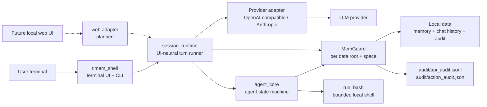
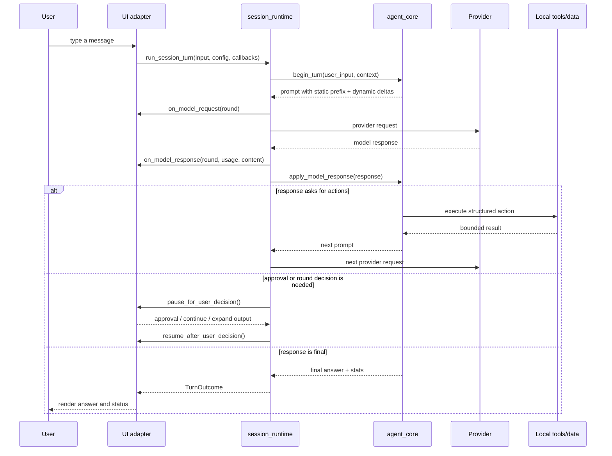
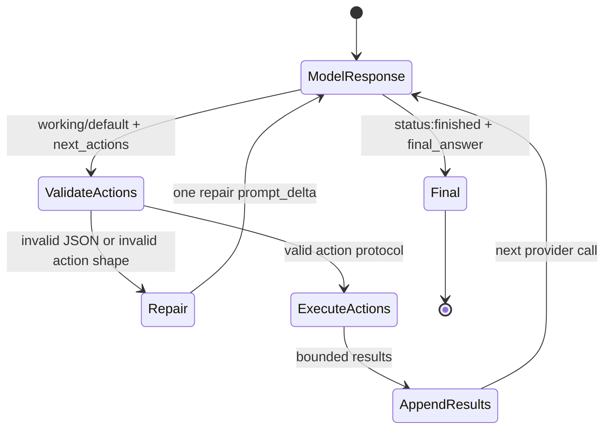
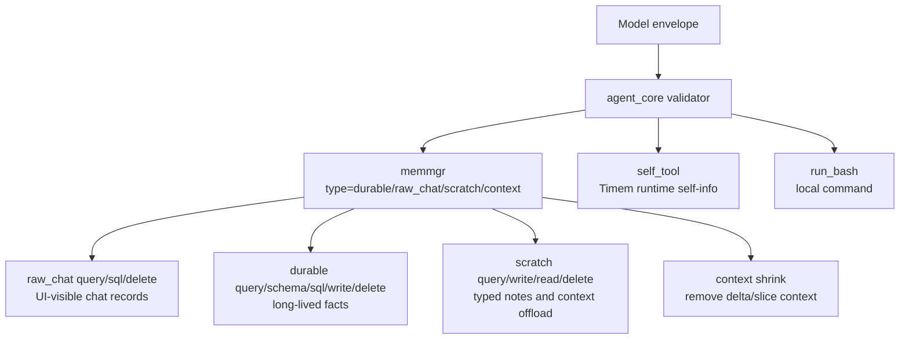

# Timem Shell Architecture

Timem Shell is a standalone Rust terminal agent. It contains the reusable agent
state machine plus a local terminal runner, provider adapters, local memory, and
bounded shell tools.

## Goals

- Keep agent behavior in Rust and independent from iOS or any cloud service.
- Let the model decide intent through explicit structured actions.
- Keep runtime responsibilities mechanical: protocol validation, persistence,
  provider IO, local command execution, and safety boundaries.
- Preserve local-first operation. API keys, audit logs, memory, and chat history
  stay on the user's machine unless the user explicitly moves them.

## Module Map



### `agent_core/`

`agent_core` owns the agent loop and is platform independent.

- Builds append-only prompt segments.
- Parses and repairs model response envelopes.
- Loads capability manifests and renders the model-facing tool catalog from the
  same JSON Schema style IDL used to validate canonical tool actions.
- Renders `prompt_0` and dynamic prompt delta/slice segments through
  `agent_core::prompt_render`, so prompt generation is a module boundary rather
  than ad hoc string assembly in the turn loop.
- Executes structured actions: memory reads/writes, chat-history reads,
  read-only SQL, and bounded `run_bash`.
- Routes memory-space file access through `MemGuard` so multiple CLI processes
  using the same data root and space do not corrupt or lose writes.
- Tracks per-turn stats: model calls, token usage, memory reads/writes, tool
  calls, and prompt shrink counters.
- Exposes a JSON-in/JSON-out C ABI for host integrations.

### `timem_shell/`

`timem_shell` owns the terminal runtime.

- Reads CLI flags and environment config.
- Renders the shell banner, Reedline-backed input prompt, observation panel,
  final answer, profiling output, and status line.
- Sends HTTP requests to providers.
- Writes local API/action audit logs with secret redaction.
- Loads shell history and runtime data from the selected data root.

Key shell-side modules:

- `main.rs`: CLI, interactive loop, Reedline input adapter, config menu, paste
  placeholder recovery, cancellation handling, startup banner rendering, and
  the CLI implementation of the turn UI callbacks.
- `session_runtime.rs`: UI-neutral turn runner. It drives `AgentCore`, provider
  calls, audit writes, profiler updates, cancellation checks, approval
  decisions, round-limit decisions, and output-token expansion decisions through
  a small `TurnUi` trait. CLI is one adapter; future Web UI should implement
  the same callbacks instead of copying the agent loop.
- `protocol_adapter.rs`: provider-specific request/response packing.
- `prompt_cache.rs`: provider cache-control planning over static prompt and
  retained dynamic deltas.
- `structured_output.rs`: protocol-specific structured-output options.
- `observation.rs`: modular Thought / Action observation events and rendering.
  It hides model-private `thought`, renders user-facing intent as top-level
  `·` rows, and renders concrete Bash/memory/context activity as wrapped child
  rows using `├─`/`└─` prefixes.
- `profiler.rs`: `/prof` token, latency, and storage reporting.

### `resources/static_v1.json`

This is the static prompt contract visible to the model. It describes the
response envelope, tool catalog, memory layers, and safety rules. It should stay
stable because providers can cache it.

The literal `tool_catalog` in this file is not the long-term source of truth.
At runtime, `agent_core` replaces it with a catalog generated from built-in
`resources/capabilities/tools/*.yaml` manifests plus an optional
`TIMEM_CAPABILITIES_DIR` overlay. See
[`docs/capability-system.md`](capability-system.md).

## Turn Lifecycle



Each turn can use multiple model/action rounds. The model must return exactly
one response envelope. If it emits malformed JSON or an invalid action shape,
the core sends one protocol repair request. If the repaired response is still
invalid, raw model text is blocked from the user and a safe fallback is shown.

The UI adapter must not own the agent loop. Its responsibilities are limited to:

- Present turn progress events such as model request/response and observations.
- Provide user decisions for approvals, round-limit continuation, stale context,
  and output-token expansion when the UI is interactive.
- Provide cancellation state.
- Render `TurnOutcome`.

Non-interactive callers should use `NoopTurnUi`, whose defaults deny approvals,
do not continue round limits, do not request output expansion, and do not
require terminal state.

## Memory Space Guard

A Timem memory space is the unit of shared memory state:

```text
identity = realpath(TIMEM_DATA_DIR) + TIMEM_SPACE
```

Within one identity, durable memory, scratch memory, chat history, SQL snapshots,
memory git snapshots, shell job indexes, and audit files are different layers of
the same mem space. They must not be split into per-session stores merely
because the UI has multiple sessions.

Current CLI implementation uses an in-process `MemGuard` object plus a
cross-process lock directory under the selected space:

```text
data/
└─ .test_mem/
   ├─ .guard/mem.lock.d/
   ├─ memory/memory.jsonl
   ├─ memory/scratch_notes.jsonl
   ├─ memory/shell_jobs/jobs.jsonl
   └─ audit/
      ├─ api_audit.jsonl
      └─ action_audit.json
```

The lock directory is created atomically, so two `timem` CLI processes pointed
at the same space serialize read-modify-write operations. This first version is
intentionally simple and dependency-free for macOS/Linux. It also matches the
future Web shape:

```text
CLI session ─┐
Web session ─┼─ MemClient ─ MemGuard ─ Storage
Worker task ─┘
```

In the future, `MemGuard` can become an actor or a local IPC daemon without
changing agent action semantics. The invariant should remain the same: one mem
space has one authoritative memory writer.

The guard has two responsibilities:

- Physical consistency: serialize file reads and read-modify-write blocks so
  JSONL/audit files are not truncated or interleaved by multiple CLI processes.
- Semantic conflict detection: durable memory rows carry `version` and
  `updated_at_ms`. Updating or deleting an existing row requires
  `expected_version`, obtained from `memmgr type=durable op=query|sql`. If
  another CLI changes the row first, runtime returns a `memory_conflict` action
  result and leaves the current row untouched.

Guarded operations include:

- durable memory append/update/delete and git snapshot
- scratch write/read/query/delete
- chat history query/delete over audit-backed records
- read-only SQL snapshots over durable memory and chat history
- `api_audit.jsonl` append
- `action_audit.json` grouped action audit updates
- shell job index append/query

Session-local state stays outside shared memory ownership:

- current prompt working context
- current observation UI state
- current turn rounds remaining
- transient cancellation and approval state

## Prompt Concepts

Timem Shell treats prompt construction as a small event log. The model never
receives hidden runtime state; it receives dynamic prompt deltas rendered into a
sequence of prompt slices.

### Prompt Slice

A prompt slice is one rendered segment in the model-visible prompt. It is a
rendering unit:

```text
[BEGIN SEGMENT 3: prompt_delta]
delta_id: pd_1782200000000_2
slice_id: ps_1782200000000_2_s001
slice: 1/2
prompt_type: result_of_llm_action
Action result: run_bash
...
time: 1782200000000
[END SEGMENT 3: prompt_delta]
```

There are two broad rendered slice classes:

- `prompt_0`: the static prefix. It is global, stable, and cache-friendly.
- `prompt_delta`: rendered slices produced from dynamic prompt deltas.

The segment number is an ordering aid. It is not a database id and should not be
used for product logic.

`delta_id` identifies the logical prompt delta. `slice_id` identifies a specific
rendered slice inside that delta. `slice_id` is intentionally regex-friendly:

```text
^slice_id: ps_[0-9]+_[0-9]+_s[0-9]{3}$
```

Runtime shrink review and future shrink actions should use these ids:

- Use `delta_id` when a whole logical delta is stale.
- Use `slice_id` when only one rendered slice of a large delta is stale.
- Durable context scoring has been rolled back from the model-visible protocol.
  Runtime must not require `durable_ctx_score`, must not repair solely because
  scoring is absent, and must not render scoring fields into prompt deltas.
  Shrink decisions should rely on explicit `delta_id` / `slice_id`, task
  relevance, age, and observed context size.
- Runtime injects long-context maintenance only when observed provider input
  tokens plus the new prompt delta estimate reaches 90% of
  `TIMEM_MAX_LLM_INPUT`. The default context window is `100K`; new prompt delta
  text that has not yet gone through the provider is estimated as roughly
  `chars / 4`.
- At that 90% threshold, runtime marks shrink as required. The model should
  compact before continuing: summarize useful dynamic prompt deltas to about
  10%-20% of their current token footprint, discard stale details, put important
  but lengthy state into scratch memory, and then use `memmgr type=context
  op=shrink` on covered `delta_id` / `slice_id` ranges.

### Prompt Delta

A prompt delta is a runtime-created logical increment. It is the full prompt
growth between model request N and model request N+1. One prompt delta can
contain multiple prompt slices, and those slices share one `delta_id`.

Examples of prompt slices inside a logical prompt delta:

- `user_question`: the user's new message plus small runtime context such as
  provider/model, local time, and remaining rounds.
- `result_of_llm_action`: the bounded result of a structured action requested by
  the model.
- `llm_response`: a final assistant answer already shown to the user.
- `llm_thought`: an optional private planning note emitted by the model's
  `thought` field. It is kept for continuity but never rendered to the user.
- `response_repair`: a low-retention repair slice created after an invalid
  model response. It includes the previous raw model response, the protocol
  issue, and the repair instruction so the next model call can fix the concrete
  mistake. Shrink should discard these slices before task evidence once the
  repair round has passed.

For example, one model response may add both an `llm_thought` slice and an
`llm_response` slice. They are one prompt delta with two rendered slices, not
two prompt deltas.

Prompt deltas are append-only in normal operation. Later provider requests
render the same static prefix plus all retained delta-derived slices, so the
model can see what it asked the runtime to do and what the runtime returned.

The relationship is:

```text
logical prompt stream
├── prompt_0                    static rendered slice
└── prompt_delta                dynamic logical increment
    ├── prompt_delta slice      rendered slice 1, e.g. llm_thought
    └── prompt_delta slice      rendered slice 2, e.g. llm_response
```

### Why Slices Exist

Slices make the rendered boundary explicit:

- The model can audit evidence because action results are visible in rendered
  slices derived from prompt deltas.
- The runtime can keep provider cache behavior stable by isolating `prompt_0`.
- Debug logs can identify which event introduced a piece of context.
- Protocol repair can be represented as another runtime delta instead of a
  hidden retry rule.

## Prompt Contract

Prompt rendering uses explicit segments:

```text
[BEGIN SEGMENT 0: prompt_0]
static prompt
[END SEGMENT 0: prompt_0]

[BEGIN SEGMENT 1: prompt_delta]
delta_id: pd_1782200000000_1
slice_id: ps_1782200000000_1_s001
slice: 1/1
prompt_type: user_question
...
[END SEGMENT 1: prompt_delta]
```

Important invariants:

- `prompt_0` is static global guidance only. It must not contain user input,
  runtime time, session context, API keys, or provider-specific secrets.
- Dynamic context belongs in logical prompt deltas that render as
  `prompt_delta` segments.
- Every rendered `prompt_delta` segment has `delta_id`, `slice_id`, and
  `slice: i/N` so runtime shrink review can refer to exact logical deltas or
  individual rendered slices.
- Valid dynamic prompt types are `user_question`, `result_of_llm_action`,
  `llm_response`, and `llm_thought`.
- The static prefix is sent through provider system-role/system-field support
  when available. Dynamic deltas go in the user message.
- Anthropic-protocol requests attach `cache_control: {"type": "ephemeral"}` to
  the static system block so the provider can reuse the prefix.

## Action Protocol

The model does not call Rust functions directly. It sends a response envelope.
The envelope contains an optional `status`, optional `report_job_progress`,
optional `next_actions`, and optional `final_answer`.
`report_job_progress` is progress text for the Thought/Action panel while
the job is working. Missing `status` defaults to `working`. `final_answer` is
the final user-visible answer when `status:"finished"`. `final_answer` and
`status:"finished"` must appear together; if one appears without the other,
runtime returns a protocol-repair slice.



### Response Envelope

The model-facing schema summary is injected from
[`resources/response_v1_summary.json`](../resources/response_v1_summary.json)
when the prompt is rendered. Keep protocol examples in this section short; the
runtime-owned schema summary is the source for the full field list shown to the
model.

The top-level JSON object has this shape:

```json
{
  "thought": "optional private planning note",
  "report_job_progress": "Checking the project files.",
  "next_actions": [
    {
      "action": "run_bash",
      "intent": "Count Rust source lines",
      "input": {
        "command": "rg --files -g '*.rs' | xargs wc -l",
        "timeout_ms": 5000
      }
    }
  ]
}
```

With omitted `status` or `status:"working"`, `next_actions` is required and
`report_job_progress` is shown in the Thought/Action panel with a runtime
progress marker. With `status:"finished"`, `final_answer` is required and is
shown as the final answer; `final_answer` without `status:"finished"` is also
rejected for repair. The guarded finalize exception allows
`status:"finished" + next_actions` only when the last action carries `expect`
and `expect_timeout_ms`; runtime executes the actions, then runs `expect`
through the same controlled Bash approval/safety path as `run_bash`. Only a
passing expect check can show `final_answer` as the final answer. Every action
needs a top-level `intent`; the shell displays it while the action runs. The
parser also tolerates common provider drift such as a valid JSON envelope
embedded in Markdown text, but it never shows raw protocol fragments to the
user.

### Action Object

Each `next_actions` item is a structured command:

```json
{
  "action": "memmgr",
  "intent": "Find recent chat messages by created time",
  "input": {
    "type": "raw_chat",
    "op": "sql",
    "sql": "SELECT created_at_ms, role, content FROM chat_messages ORDER BY created_at_ms DESC",
    "limit": 20
  }
}
```

Fields:

- `action`: canonical tool name, such as `memmgr`, `run_bash`, or
  `shell_job_status`. `memmgr` is the single model-facing interface for durable
  memory, raw chat history, scratch memory, and dynamic context shrink.
- `intent`: concise human-readable reason. It is required because shell UI uses
  it as action status.
- `input`: action-specific structured parameters. Runtime validates this shape
  before executing anything.

The runtime may accept narrow compatibility aliases for older model outputs, but
new prompt and documentation should use canonical action names.

### Action Result Slice

After an action runs, `agent_core` appends a `result_of_llm_action` slice into
the current runtime increment's prompt delta. The rendered slice or slices from
that delta are the only evidence the model may claim it has seen.

Example:

```text
[BEGIN SEGMENT 5: prompt_delta]
delta_id: pd_1782200001000_4
slice_id: ps_1782200001000_4_s001
slice: 1/1
prompt_type: result_of_llm_action
Action result: memmgr
type: raw_chat
op: sql
rows:
- created_at_ms: 1782200000000
  role: user
  content: ...
time: 1782200001000
[END SEGMENT 5: prompt_delta]
```

The model then receives another prompt containing this result and decides
whether to answer or ask for another action.

### Protocol Repair

Provider output is untrusted. The runtime validates:

- The response is a JSON object or contains an extractable JSON envelope.
- `report_job_progress`, `continue`, and `acceptance_check` follow the contract.
- `next_actions` is an array when present.
- Every action has `action`, `intent`, and valid `input`.
- SQL and bash actions pass their own safety checks.

If validation fails, the runtime appends one repair slice in the current runtime
increment:

```text
prompt_type: result_of_llm_action
Protocol repair request
issue: next_actions[0].intent_required
Return exactly one valid JSON object with report_job_progress.
```

Only one repair round is allowed per model response failure. If the repair also
fails, the shell blocks raw model text and shows a safe fallback instead.

## Tool Surface



### Memory and Chat History

Timem separates three layers:

- Chat history: persisted user/assistant records shown in the shell transcript.
- Durable memory: long-lived user facts explicitly stored by the agent.
- Prompt deltas: current in-process context and action results.

Do not collapse these layers. A chat-history lookup is not durable memory, and
durable memory does not prove that a visible chat transcript exists.

Current implemented surface:

- Chat history search: `memmgr` with `type=raw_chat, op=query|sql` over
  `chat_messages`.
- Chat history deletion: `memmgr` with `type=raw_chat, op=delete`. The SQL surface remains
  read-only and cannot delete `chat_messages`.
- Durable memory search: `memmgr` with `type=durable, op=query|schema|sql`.
- Durable memory insert/update/delete: `memmgr` with
  `type=durable, op=insert|update|upsert|delete`. Existing-row
  update/delete requires `expected_version` to avoid stale multi-CLI writes.
- Durable memory versioning: durable writes snapshot `memory.jsonl` in a local
  git repository under the selected memory directory when git is available.
- Scratch memory: `memmgr` with `type=scratch, op=query|write|read|delete` over
  `scratch_notes.jsonl`.

### Timem Self Tool

`self_tool` is for questions or requests about Timem itself, not user memory or
local project work. Current surfaces:

- `type=env, op=read|write`: read or update non-sensitive environment values in
  the current Timem process. API key, token, secret, password, credential, and
  access-key-like variables are denied. Memory path variables such as
  `TIMEM_DATA_DIR` and `TIMEM_SPACE` are startup-only and cannot be changed via
  `self_tool`; use CLI/env at startup instead.
- `type=mem_path, op=read`: list the current memory space, memory files, and
  API/action audit files.
- `type=about_me, op=read`: report TimemAi name, version, author/contact,
  project/star info, and a short software summary, plus current process id,
  working directory, and executable path.

Candidate future surfaces are `config` for runtime config inspection,
`workspace` for loaded workspace references, `capabilities` for active
capability overlays, and `diagnostics` for recent retry/repair counters. These
should stay scoped to Timem runtime state; file work remains `run_bash`, and
memory work remains `memmgr`.

### Read-only SQL

`memmgr` SQL ops read a restricted SQLite surface:

- `memories(id, created_at_ms, updated_at_ms, version, content)`
- `chat_messages(id, session_id, turn_id, role, content, created_at_ms, source,
  profile_name, model_name, source_message_id)`

Only `SELECT`, `WITH ... SELECT`, and `PRAGMA table_info(...)` for those tables
are allowed. Write statements, DDL, SQLite metadata tables, and mismatched SQL
placeholders are rejected before execution.

### Local Shell Action

`run_bash` is for shell sessions only. It lets the model inspect or modify the
local working area when the user asks for local work and memory/chat tools are
not enough.

Current shell approval is configured at startup:

- `TIMEM_BASH_APPROVAL=ask`: ask before running bash actions.
- `TIMEM_BASH_APPROVAL=approve`: run bash actions directly.

The runtime validates structured action shape and command limits. It does not
infer the user's semantic goal from the natural-language text.

Short commands run in the foreground. Long-running commands should use
`run_bash` with `background=true` or `mode=background`. Runtime returns a
`job_id`, output file, and status file; the model then uses `shell_job_status`
to poll the job instead of repeating the long command.

### Context Shrink Action

`memmgr` with `type=context, op=shrink` is the structured action that actually
removes dynamic prompt context. It accepts ids that came from rendered prompt
slices:

```json
{
  "action": "memmgr",
  "intent": "Remove stale context by id.",
  "input": {
    "type": "context",
    "op": "shrink",
    "delta_ids": ["pd_1782200000000_2"],
    "slice_ids": ["ps_1782200001000_4_s001"]
  }
}
```

Rules:

- `delta_ids` removes whole logical prompt deltas.
- `slice_ids` hides exact rendered slices inside a delta.
- `prompt_0` is never removable.
- Hidden slices are not rendered in later prompts and are not returned by
  prompt-delta fallback search.

Forced compaction uses the same response envelope and action protocol; it does
not introduce a separate `compressed_delta` schema. The model decides what
should be offloaded and supplies ids; runtime owns validation and copies actual
prompt delta/slice content into scratch. A typical forced shrink response first
asks runtime to offload covered prompt context, then shrinks those dynamic ids:

```json
{
  "thought": "Compact dynamic context before continuing.",
  "status": "working",
  "report_job_progress": "Preparing to compact dynamic context.",
  "next_actions": [
    {
      "action": "memmgr",
      "intent": "Offload dynamic prompt context before shrinking.",
      "input": {
        "type": "scratch",
        "op": "write",
        "kind": "context_offload",
        "label": "release validation context",
        "delta_ids": ["pd_1782200000000_2", "pd_1782200001000_3"]
      }
    },
    {
      "action": "memmgr",
      "intent": "Remove dynamic prompt deltas covered by the compact summary.",
      "input": {
        "type": "context",
        "op": "shrink",
        "delta_ids": ["pd_1782200000000_2", "pd_1782200001000_3"]
      }
    }
  ],
  "acceptance_check": {
    "is_satisfied": false,
    "missing_info": ["shrink action results"]
  }
}
```

Scratch write has two modes under `memmgr type=scratch op=write`:

- `kind=notes`: model provides `label` and `content`; runtime stores the note and
  returns `id`, `label`, `type`, and a short preview.
- `kind=context_offload`: model provides `label` and `delta_ids`/`slice_ids`;
  runtime verifies the ids are visible dynamic prompt context, rejects `prompt_0`,
  copies the real content into scratch, and returns only index metadata plus a
  preview. The model later uses `memmgr type=scratch op=read` with the returned
  id to retrieve full details when needed.

This keeps the boundary explicit: the model reasons over labels and ids, while
runtime performs trusted prompt-context transfer.

## Provider Layer

Provider label and API protocol are deliberately separate:

- `TIMEM_GATEWAY_PROVIDER` selects the traffic platform and default URL.
- `TIMEM_API_PROTOCOL` selects the wire format.
- `TIMEM_MAX_LLM_INPUT` selects the assumed maximum model input context
  window; default is `100K`.
- `TIMEM_MAX_LLM_OUTPUT` selects the maximum model output token budget; default
  is `10K`.

Supported protocols:

- `openai-compatible`
- `openai-responses`
- `anthropic`

Examples:

```text
aliyun    -> OpenAI-compatible by default
openai    -> OpenAI-compatible by default
anthropic -> Anthropic by default
custom    -> set TIMEM_API_PROTOCOL and TIMEM_BASE_URL explicitly
```

`TIMEM_BASE_URL` can override the provider default. API keys are read from
environment/config and are redacted from audit logs.

## Runtime Data

By default, data is scoped to the directory where `timem-shell` starts:

```text
data/<space>/audit/api_audit.jsonl
data/<space>/audit/action_audit.json
data/<space>/memory/
data/<space>/memory/shell_jobs/
data/<space>/shell_history.txt
```

Use `TIMEM_DATA_DIR=/path/to/data` for a fixed data root.

The API audit log records provider requests/responses and final turn summaries.
The action audit log groups model-requested actions by user turn and model
interaction. These are debugging artifacts, not user-facing transcripts.
Secrets are redacted.

## Runtime Boundary

The runtime must not understand natural-language user semantics.

Allowed runtime behavior:

- Validate protocol shape.
- Classify and bound structured tool execution.
- Run lexical search over exact query text.
- Package evidence and tool results for the model.
- Repair malformed response envelopes.

Forbidden runtime behavior:

- Keyword-based intent routing such as detecting "昨天", "生日", or "名字".
- Semantic alias tables or hardcoded query rewrites.
- Auto-running memory/chat/shell/search prechecks based on user wording.
- Fixing one bug report by adding case-specific prompt or runtime rules.

The model owns semantic interpretation. The runtime owns state, safety,
persistence, and evidence delivery.

## Testing Strategy

The standalone shell should stay releasable with:

```bash
cargo fmt --check
cargo test --workspace
cargo build -p timem_shell --release
```

Core tests cover:

- Prompt append-only behavior and static prefix separation.
- Response-envelope repair and malformed-provider output handling.
- Memory, chat history, read-only SQL, and SQL safety.
- `run_bash` action validation and execution behavior.
- Provider config, endpoint construction, usage/cached-token parsing.
- Shell rendering contracts for thinking/final status lines.

When adding a capability, update this document, implement the code, then add or
adjust tests for the invariant being changed.
