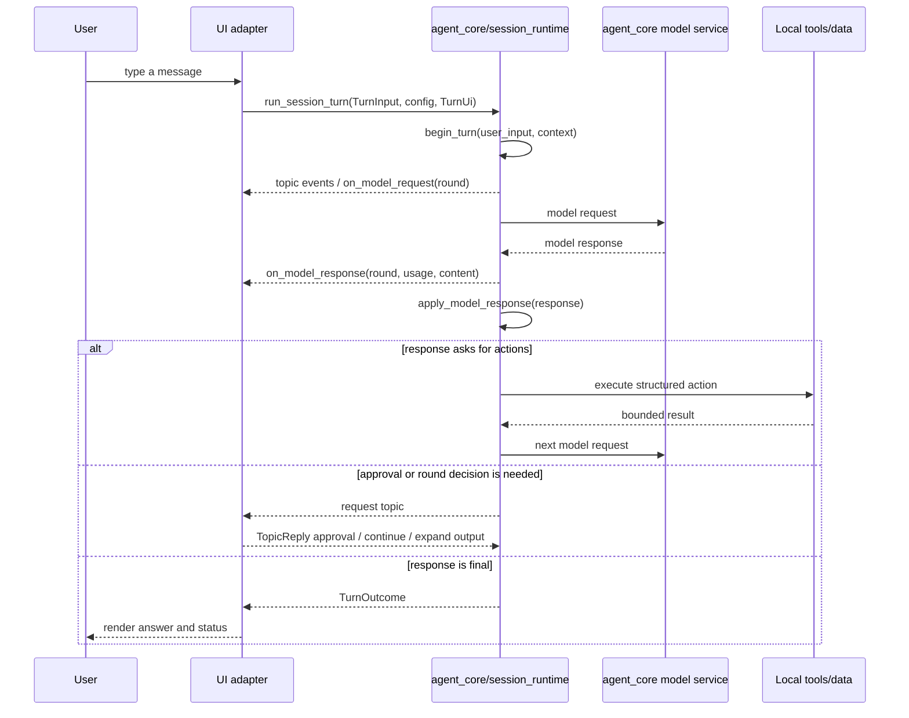
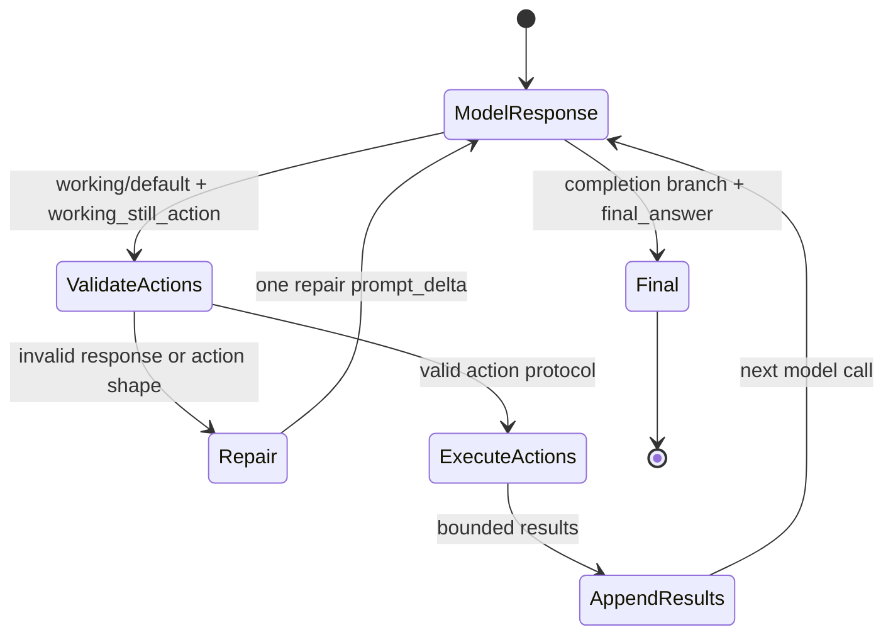
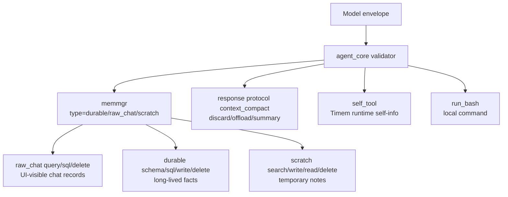

# Timem Architecture

Timem provides terminal and local-browser hosts for the reusable Timem Rust
agent core. Each host owns its input and rendering. `agent_core` owns the
reusable runtime, model transport, memory, model protocol parsing,
capability execution, session persistence, and structured core/UI topic
protocol.

## Current Product Shape

Timem is now a multi-host local agent:

- `timem` is the native terminal host.
- `timem-web` is an authenticated local-first browser host with an assistant-ui
  frontend. It binds loopback by default and exposes non-loopback HTTP only
  through the explicit `--public` mode.
- Both hosts run the same `agent_core` and use the same memory/session store.

### 1.1 Product Boundary

Version 1.1 makes `timem-web` the recommended interface. The shortest supported
path is to run `timem-web`, then configure the selected Session in the browser.
The Web host owns authenticated transport and Session orchestration, the Web UI
owns presentation and recoverable browser intent, and the core remains the
single source of truth for agent behavior:

```text
Browser / assistant-ui
        |
        | authenticated HTTP + WebSocket, structured commands/topics
        v
timem_web host
        |
        | session/context/worker routing
        v
agent_core
        |
        +-- model transport and protocol adapters
        +-- prompt/context and memory persistence
        +-- capability registry and safe execution
        +-- session workers and cross-host resume
```

The Web surface includes per-Session model/API configuration, multi-session
profiles, paged history,
attachments, queued next-turn questions, explicit active-turn supplements, inline decisions, live action lifecycle
rows, reconnect/runtime-exit states, context-compact visualization, Markdown
rendering, syntax highlighting, responsive layout, and final usage telemetry.
These are host renderings of core data; they must not be reimplemented as a
second model service, prompt, memory, or action runtime.

Version 1.1 also defines a durable browser/Host/Core delivery boundary:

- user mutations carry stable `command_id` values and move through correlated
  `accepted`, `committed`, or `rejected` acknowledgements;
- the browser retains pending intent until authoritative commit instead of
  treating `WebSocket.send()` as delivery;
- authoritative UI events are journaled per memory space with monotonic
  `event_seq` values and replayed from a client cursor after reconnect;
- commands are FIFO within a Session while independent Sessions may work in
  parallel, and memory-space changes use an epoch barrier;
- API keys and MCP secrets remain request-scoped direct replies and never enter
  snapshots, semantic event journals, prompts, history, or audit.

The executable contract for these invariants is
[`web_reliability_test_matrix.md`](web_reliability_test_matrix.md).

The split is intentional. Core owns reusable behavior and emits structured
events. Hosts own presentation, input, and host-only ergonomics. A feature that
affects model behavior, model calls, memory, tools, sessions, protocol
parsing, or cross-host state belongs in core/resources. A feature that only
changes terminal or browser presentation belongs in the host/UI layer.

## Reading Order

For a new contributor, read these in order:

1. [`README.md`](../README.md): project overview, install, run, and docs map.
2. [`install-and-configuration.md`](install-and-configuration.md): operational
   setup, model service examples, and runtime data layout.
3. This file: runtime architecture and module ownership.
4. [`core-ui-topic-protocol.md`](core-ui-topic-protocol.md): cross-language
   topic contract between core and hosts.
5. [`capability-system.md`](capability-system.md): tool manifests and executor
   registration.
6. [`test-strategy.md`](test-strategy.md) and
   [`feature-test-management.md`](feature-test-management.md): quality gates and
   feature coverage ledger.

For module-local work, also read:

- [`agent_core/module_boundary.md`](../agent_core/module_boundary.md)
- [`timem_shell/module_boundary.md`](../timem_shell/module_boundary.md)
- [`timem_web/module_boundary.md`](../timem_web/module_boundary.md)
- [`web_ui/module_boundary.md`](../web_ui/module_boundary.md)

## Goals

- Keep agent behavior in Rust and independent from iOS or any cloud service.
- Let the model choose concrete structured actions when runtime work is needed.
- Keep runtime responsibilities mechanical: protocol validation, persistence,
  model service IO, local command execution, and safety boundaries.
- Preserve local-first operation. API keys, audit logs, memory, and chat history
  stay on the user's machine unless the user explicitly moves them.

## Module Map

```mermaid
flowchart LR
    User["User terminal"] --> Shell["timem_shell\nterminal UI + CLI"]
    Browser["Local browser"] --> WebUI["web_ui\nassistant-ui + React"]
    WebUI <--> Web["timem_web\nloopback HTTP/WebSocket host"]
    Shell --> Core["agent_core\nruntime + topic protocol"]
    Web --> Core
    Core --> Runtime["agent_core::session_runtime\nUI-neutral turn runner"]
    Runtime --> Model service["agent_core::model_transport\nmodel service I/O"]
    Model service --> Wire["agent_core::model_api\nwire-format adapter"]
    Model service --> LLM["LLM service"]
    Core --> Guard["MemGuard\nper data root + space"]
    Guard --> Store["Local data\nmemory + chat history + audit"]
    Core --> Caps["Capability registry\nYAML IDL + tool callbacks"]
    Caps --> Tools["resources/capabilities/tools\n{tool}.yaml + {tool}.rs"]
    Core --> Exec["Tool execution\nbuiltin + command-bound jobs"]
    Guard --> Audit["audit/api_audit.json\naudit/action_audit.json"]
```

### `agent_core/`

`agent_core` owns the agent loop and is platform independent.

`agent_core/src/os/` is the centralized operating-system policy boundary.
Its common interface owns host/version detection, executable conventions,
default configuration roots, browser/terminal launch commands, and reusable
process/process-group lifecycle operations. Platform policy implementations
currently live in `os/macos.rs` and `os/linux.rs`. Business modules consume the
common interface and must not add direct macOS/Linux branches or fixed system
command paths. Low-level Unix mechanisms intrinsic to a subsystem—such as
terminal `termios`, file permission bits, nonblocking file descriptors, and
file locking—remain beside that subsystem rather than being hidden behind an
OS policy facade.

- Provides reusable capability functions and state-machine functions. Host
  adapters call core functions instead of reimplementing agent behavior.
- Exposes state/progress through structured topic events and structured return
  values. Hosts receive `CoreTopicEvent` batches via core dispatch methods, then
  render the resulting data in their own UI style.
- Defines host-independent turn adapter helpers such as user-supplement
  normalization. A terminal, Web, or native host may collect input differently,
  but empty/whitespace supplement filtering before adding `user_supplement`
  slices is a core boundary rule.
- Returns structured output, not terminal strings. A shell, Web UI, or iOS app
  may render the same core data as ANSI text, HTML, native views, logs, or
  accessibility-friendly UI.
- Represents non-normal turn endings with structured `TurnStopReason` values
  such as cancellation, model service error, output-limit stop, or round-limit
  stop. Hosts may still show the fallback text, but should not infer state by
  parsing localized user-facing strings.
- Builds append-only prompt segments.
- Parses and repairs model response envelopes through
  `agent_core::response_protocol`. The parser modules are runtime code, not
  model-facing prompt resources. Each protocol suite owns issue-specific repair
  guidance and may inspect the malformed raw response to provide a concrete,
  protocol-native correction skeleton; the turn loop only assembles the shared
  temporary repair delta and audit record.
- Loads capability manifests and renders the model-facing tool catalog from the
  same JSON Schema style IDL used to validate canonical tool actions.
- Renders `prompt_0` and dynamic prompt delta blocks through
  `agent_core::prompt_render`, so prompt generation is a module boundary rather
  than ad hoc string assembly in the turn loop.
- Owns model transport in `agent_core::model_transport`, including model
  HTTP execution, cancellation polling, request/response audit append, and
  model response handoff.
- Owns model API wire-format construction and response parsing in
  `agent_core::model_api`: OpenAI-compatible chat completions, OpenAI Responses,
  Anthropic messages, structured-output hints, endpoint joining, usage parsing,
  truncation detection, model HTTP error normalization/redaction, model service
  default protocol/base URL/model rules, model service cache-control block
  translation, and model request/response audit event data.
- Owns model service-agnostic prompt cache planning in `agent_core::prompt_cache`.
  The algorithm splits rendered prompt into static prompt and dynamic
  delta blocks, marks stable cache boundaries, and returns shell/UI-neutral
  data structures for host adapters to translate into model requests.
- Owns UI-neutral profiling state in `agent_core::profiler`: per-model token
  totals, cache hit/create counters, model wait/local work timing, and storage
  size snapshots. It exposes raw `RuntimeProfileReport` data as the
  shell-independent `/prof` data shape; host adapters decide how to format
  counts, durations, percentages, units, and layout.
- Owns UI-neutral runtime configuration report data in
  `agent_core::config_report`, including effective model service/runtime/data
  rows and default/default-overridden semantic flags. Host adapters render this as a
  terminal startup banner, settings screen, or web panel.
- Owns UI-neutral token/status summary and view-model data in
  `agent_core::status_summary`: meaningful latest usage detection, total/latest
  token breakdowns, context percentage, progress-bar fill counts, model rounds,
  and repair counts. Host adapters choose symbols, compact number formatting,
  and layout.
- Owns the UI-neutral runtime status snapshot shape in
  `agent_core::status_view`, including structured retry status. Hosts may render
  retry countdowns, details, colors, or notifications differently, but should
  not store retry state as scattered UI strings.
- Normalizes model free_talk/actions into UI-neutral topic events after model
  response parsing: visible working notes, activity state, memory
  read/write activity, and structured `CoreActionKind` values such as Bash,
  memory, capability, or self-tool activity. Core may include raw action/input
  as evidence, but hosts should render from the structured kind instead of
  parsing protocol-specific action JSON. Host adapters render these topic events
  as terminal panels, native app status, web events, or other UI-specific forms.
- Owns API audit document append/migration mechanics and UI-neutral runtime
  event builders in `agent_core::audit`. Host adapters choose audit file paths
  and decide when to append events.
- Executes structured actions through the capability registry. Built-in tool
  packages live under `resources/capabilities/tools/{tool}.yaml` plus a paired
  `{tool}.rs` callback; overlay command tools are loaded from the capability
  directory. The shell UI may provide user decisions such as approval, but
  command execution, registered tool job lifecycle, evidence shaping, and tool
  audit are core responsibilities.
- Routes memory-space file access through `MemGuard` so multiple CLI processes
  using the same data root and space do not corrupt or lose writes.
- Tracks per-turn stats: model calls, token usage, memory reads/writes, tool
  calls, and prompt shrink counters.
- Tracks reminder schedules independently for every active Session worker.
  Terminal and Web hosts load one user-global `reminder_tips.json` at startup;
  Core evaluates its active-minute and completed-round schedules before model
  requests and routes random selections through the normal `SYSTEM`
  prompt-component queue. `NONE` consumes a due interval without injection.
  Time paused for a host decision is excluded, blocking model/tool calls are not
  interrupted, and missed time periods collapse instead of producing a backlog.
- Exposes a JSON-in/JSON-out C ABI for host integrations.

### `timem_shell/`

`timem_shell` owns the terminal host and UI.

- Reads CLI flags and environment config.
- Parses terminal-only user commands and maps shared commands to core functions
  where appropriate.
- Renders the shell banner, Reedline-backed input prompt, observation panel,
  final answer, profiling output, and status line.
- May provide shell-only commands for terminal user experience, such as
  `/config`, `/prof`, input recovery, or other TTY conveniences. These commands
  stay outside the model-visible capability surface when they do not require
  agent reasoning, memory actions, or tool protocol cooperation.
- Chooses local API/action audit paths and records host turn events through
  core-owned audit document writers and redaction helpers.
- Loads shell history and runtime data from the selected data root.

Key shell-side modules:

- `main.rs`: CLI, interactive loop, Reedline input adapter, config menu, paste
  placeholder recovery, cancellation handling, startup banner rendering, and
  the CLI implementation of the turn UI callbacks.
- `observation.rs`: modular Thought / Action observation events and rendering.
  It consumes `CoreTopicEvent` values instead of parsing model responses in the
  shell production path, and renders `CoreActionKind` values as concrete
  Bash/memory/context activity rows.
- thinking status hints use `agent_core::topic_event_status_hint`; shell only
  maps the returned memory activity to a terminal marker.
- `profiler.rs`: shell rendering for `/prof` from `RuntimeProfileReport`;
  profiling state, report data generation, and storage collection live in
  `agent_core::profiler`.
- startup/config rendering uses `RuntimeConfigReport` from
  `agent_core::config_report`; shell owns keyboard menus and table drawing.

Host-specific commands are acceptable when they are purely presentation or
adapter ergonomics. If a feature must be visible to the model, callable by the
model, shared by iOS/Web/CLI, or reflected in prompt/capability contracts, it
belongs in `agent_core` or `resources` instead of being implemented as a
shell-only shortcut.

### `timem_web/`

`timem_web` is a local-first host adapter, not a second agent runtime. It binds
to `127.0.0.1` by default and binds to `0.0.0.0` only after the explicit
`--public` option. Browser, API, upload, and WebSocket access remain protected
by one per-process token in either mode. The host embeds the production
frontend and maps browser commands to public
`agent_core` worker/session interfaces. It preserves session and request ids on
every topic, assigns stable event ids, and keeps one bounded host-side turn
envelope for the task text, supplements, approvals, process events, final answer,
and completion telemetry. Uploads, retained turns, per-turn user entries, and
per-turn process events are bounded independently. Concurrent workers never
share a turn envelope. Model calls, prompt construction, memory, protocol
parsing, and tool execution remain in `agent_core`.

The WebSocket receive loop never executes host commands inline. Each connection
uses one bounded FIFO command queue whose worker runs synchronous filesystem and
Session operations on Tokio's blocking pool. Core topics continue flowing while
such a command is pending, command order is preserved, and a click flood receives
an explicit queue-full error instead of creating unbounded work.

Web host availability is independent from model-model service readiness. Startup may
construct an incomplete model service draft with an empty API key so the browser can
open, restore history, and expose its Session configuration controls. The Web
submission boundary validates the selected Session before creating a turn or
calling a worker. Missing credentials reject only that Send/ToolGen request;
Shell and actual model calls continue to use strict model service validation.

The Web Session is also the runtime-configuration ownership boundary. On
creation, `timem_web` copies the current host defaults and applies a validated
allowlist of Session overrides for model service, model, wire/response protocols,
base URL, token limits, timeout, approval/work-instruction policy, and API key.
Existing Sessions are immutable when host defaults change; later Sessions see
the new defaults. The persisted `StoredSession.env` and `StoredSession.profile`
are part of cross-host resume, not Web-only UI state. When Shell or Web resumes
a stored Session, it must rebuild the active core/model service configuration from
that Session environment while preserving explicit launch-time CLI overrides as
the highest-priority source. Supported runtime configuration changes update the
Session cache immediately instead of waiting for another completed turn.
API keys are stored only in the local Session index, whose Unix permissions are
restricted to the owning user, and remain in the server-side Session runtime.
They are never serialized into browser snapshots or topics and are not injected
into model prompts or audit output. The Web settings panel may replace or clear
the selected idle Session's API key. The browser sends the value once over its
authenticated WebSocket; the acknowledgement and later snapshots expose only an
`api_key_configured` boolean. Core workers receive the new credential before the
next turn, and an active turn rejects credential changes to avoid mixed
authentication within one task. A Session owns explicit
`contexts[]` and `workers[]` registries. All of its workers share the Session
profile, while each Context owns its prompt/workspace state. Different Sessions
remain isolated and may use different profiles. The current UI creates one
default Context and primary Worker, but identity and routing already support
child workers on additional contexts.

The current ownership cardinality is one mutable `AgentCore` per Context and
one worker per Context. Spawning a concurrent subtask therefore allocates a new
Context and then attaches a child Worker whose `parent_worker_id` names the
requesting worker. The manager rejects duplicate `(session_id, context_id)`
workers and cross-Session parent links. Sharing one mutable Context between
workers requires a future context coordinator and is intentionally not implied
by the present arrays.

The primary Worker is the sole user-facing communication endpoint for a Web
Session. Child-worker process output and decision requests are projected into
the primary turn. Decision topics retain the requesting `worker_id` as a relay
address; after the user's choice is recorded in the primary conversation, the
host routes the structured reply back to that waiting worker. Child final
answers remain internal task results and cannot close or directly append to the
primary chat.
Child creation never creates a browser Session or another user conversation.
The sidebar remains a list of user-owned Sessions; internal contexts/workers
are visible only through the owning Session's structured process stream and
diagnostics.

User Stop/Cancel is a Session-wide task barrier and cancels every active worker.
The next user turn targets only the primary Worker. The primary may choose to
create fresh child Context/Worker pairs, but cancelled children are never
implicitly resumed.

The shell host intentionally creates one default Session and does not add a
Session-profile dialog. Its existing process environment and CLI options become
that Session's profile. This keeps CLI behavior unchanged while preserving the
same ownership model as Web.

Session persistence and resume are core data capabilities, not Web-only state.
`agent_core::session_store` owns the shared `StoredSession`,
`ChatHistoryRecord`, history paging, and resume-notice schema used by Shell and
Web. Hosts may render restored turns differently, but the persisted chat history
format is JSONL with explicit `message` and `event` records so a future host can
page and replay the same data. The first resume implementation intentionally
does not persist live Worker/Context runtime state or running action queues:
when a Session is restored, the host creates a fresh primary Worker and Context,
then injects one `## RUNTIME` notice pointing the model to the raw chat history
file and its exact format. The model should read that file only when needed for
the current task, using bounded tools such as `tail`, `rg`, `jq`, or short
scripts instead of loading the whole file into prompt context. Web restores the
latest 200 history records by default and requests older pages in 200-record
chunks; Shell uses the same Session store and appends its turns to the same raw
history file so Web and Shell can continue the same mem-space work. The Session
also caches the effective allowlisted TIMEM runtime environment. This permits a
restart without re-entering model service settings while keeping explicit launch CLI
options authoritative. On Unix, the Session directory and index use `0700` and
`0600` permissions because the index may contain the Session API key.

### `web_ui/`

`web_ui/timem-web` owns assistant-ui/React composition, Markdown and syntax
highlighting, session navigation, session-scoped inline decision queues, themes,
responsive layout, and turn rendering. One task is presented as a `YOU` frame
that accumulates supplements and approval replies, a bounded scrollable Timem
process frame for free talk/actions/repair/compaction/requests, and a separate
final-delivery block with token and elapsed-time telemetry. Stable host event ids
make reconnect/snapshot replay idempotent. Browser preferences such as dark/light
theme remain local UI state.

Inbound WebSocket events are drained in ordered, frame-budgeted batches so an
action burst yields to keyboard and scroll frames without dropping events. The
conversation mounts only a progressive turn window, memoizes that turn subtree
away from composer keystrokes, and applies browser `content-visibility` only to
completed offscreen turns. The active working turn remains fully rendered.

The Web session snapshot includes the prompt context's cwd. When Core reports a
successful prompt-context cwd change, its existing `core.action` finish topic
includes `context_state.cwd`. `timem_web` updates the authoritative session before
forwarding the event, and the browser reducer updates only the matching session.
This keeps reconnects, navigation, the composer, and later `run_bash` execution
on the same cwd without creating a separate fine-grained topic.
The ignored `web_ui/vendor/assistant-ui` checkout is only a pinned source
reference; production uses the package lock and embeds the built `dist` assets.

In short:

```text
agent_core:
  - reusable fn() capability/state APIs
  - CoreTopicEvent-style structured topic protocol
  - structured outputs and structured decisions
  - model protocol parsing, model request preparation, memory/tools

UI host:
  - render(structured_output)
  - parse UI gestures/commands and call core fn()
  - implement UI-only functions such as shell-only slash commands
  - own terminal/web/native layout, strings, colors, key handling, and host IPC
  - do not implement model service transport or model-requested tool execution
```

Do not over-centralize UI concerns into core. Core should expose data, abstract
process state, reusable operations, and structured topic events. Each host
keeps freedom to present that data differently and to implement host-only
ergonomics when they do not become shared model-visible capability.

### `resources/`

`resources/` owns model-facing prompt materials and capability manifests.
`agent_core/src` owns runtime structures, executable response parsers, model service
wire-format adapters, and executors. It should not contain system prompt text or
protocol prompt prose.

- `resources/system_prompt/system_prompt.md`: Markdown static prompt shell.
  It is the stable model-visible outer contract and contains placeholders for
  protocol and capability injection.
- `resources/protocol/json/`: JSON response protocol prompt injection, schema
  summary.
- `resources/protocol/xml/`: XML response protocol prompt injection, schema
  summary.
- `scripts/update_static_prompt_snapshot.sh`: one-shot expanded prompt generator
  for human review. Generated files are written under `target/` by default and
  are not checked into the repository.
- `resources/capabilities/tools/*.yaml`: tool capability manifests. The same
  manifest data renders the model-facing tool catalog and validates parsed
  action arguments before execution.

The literal `{{TOOL_CATALOG}}` placeholder in this file is not the long-term
source of truth. At runtime, `agent_core` replaces it with a catalog generated from built-in
`resources/capabilities/tools/*.yaml` manifests plus an optional
`TIMEM_CAPABILITIES_DIR` overlay. See
[`docs/capability-system.md`](capability-system.md).

### Dynamic MCP capabilities

MCP server definitions are persisted under the active mem. A Session stores
only the server ids enabled for that Session. UI edits update this desired set,
but do not mutate a running context. External MCP discovery is never on the Web
startup, Session restore, worker creation, or turn-submission critical path.
Those paths apply only an exact connected cache and schedule missing discovery
on a deduplicated background task. A successful discovery advances the
Session's desired revision for the following new-turn boundary; an unavailable
server becomes connection-status evidence and does not stall agent work.
`agent_core::mcp` then projects the discovered tools into the same capability
registry used by prompt rendering, response validation, executor routing, and
action topics. Names are namespaced as `mcp.<server>.<tool>` to avoid collisions.

MCP definitions never enter the cacheable static system prompt. Inline mode
stores complete canonical JSON definitions, MCP initialize `instructions`, and
enable/disable updates in the ordinary persistent prompt-delta sequence. Later
inline requests reuse those append-only deltas instead of regenerating a
synthetic catalog for every render. Native mode filters those inline-only
catalog/update slices out of the rendered messages. Its currently enabled MCP
definitions exist only in the provider API `tools` field, and MCP server-wide
instructions are carried by the corresponding native tool descriptions.
Enabling, disabling, or changing an MCP definition therefore changes the next
native API tools field without adding a redundant RUNTIME availability notice.
Core decides whether to append this delta from the model-visible tool
definitions (`name`, `description`, and `input_schema`) plus server
`instructions`, not from raw MCP
configuration equality. Transport, timeout, endpoint/header, credential, and
display-metadata changes update runtime state silently when callable definitions
are unchanged.

The worker command channel orders the capability update before the user turn.
Core compares complete MCP tool definitions with the previously applied set. A
real add/update/remove injects one natural-language `SYSTEM` prompt component
into that new delta; an unchanged set injects nothing. This preserves prompt
cache stability and prevents a UI toggle from changing an in-flight model turn.

The model response parser does not contain MCP-specific syntax. It accepts a
generic registered action plus a JSON argument object; the executor resolves
the MCP binding and calls `tools/call`. Full `inputSchema` validation remains
authoritative at the MCP server because reducing JSON Schema to Timem's builtin
manifest rules could reject valid nested arguments. Connection, validation,
and tool failures return bounded natural-language action evidence so the model
can recover without entering response-protocol repair. MCP config secrets are
stored server-side with restricted file permissions and rendered as `****` in
Web snapshots. An authenticated editor may request a one-time reveal; the host
returns plaintext only to that requesting WebSocket, never through broadcast
topics, snapshots, prompts, history, or audit. The browser drops revealed
values on panel close, Session/mem change, reconnect, or save.

Streamable HTTP is the recommended remote transport and accepts either a JSON
response or an SSE response stream from the same MCP endpoint. Legacy SSE is a
separate compatibility transport: Core opens the configured SSE URL, reads its
`endpoint` event, POSTs JSON-RPC messages to that endpoint, and correlates
responses arriving on the event stream. Web keeps an independent unsaved draft
for every transport so switching the editor selection does not discard input.

## Response Protocol Suites

Timem separates model-facing protocol instructions from runtime parsing:

```text
resources/protocol/<suite>/
└─ response_protocol.md          model-facing instructions injected into prompt_0

agent_core/src/response_protocol/
├─ mod.rs                        protocol-independent ParsedEnvelope/ParsedAction
├─ json_suite.rs                 JSON response parser and repair policy
└─ xml_suite.rs                  XML response parser and repair policy
```

The `resources/protocol/<suite>` files are model-facing prompt resources and
review snapshots. The Rust modules under `agent_core/src/response_protocol/`
are executable parser suites. They intentionally live in code because they
define runtime behavior, repair boundaries, and tests; they must stay aligned
with the resource text and generated expanded prompt output from
`scripts/update_static_prompt_snapshot.sh`.

The XML suite uses a protocol-specific tag scanner rather than a general XML
tree parser. It recognizes only the small response vocabulary under the single
`<ASSISTANT>` root. Once it enters a raw text field (`free_talk`,
`final_answer`, or compact `summary`), it extracts that field as text and does
not scan its contents for nested protocol tags. This prevents XML/JSON/Markdown
examples inside user-visible text from being re-parsed as runtime actions.
For non-terminal action rounds, the XML parser can recover accidental prose
outside the root and emits a model-visible `SYSTEM TIPS` correction for the next
round. Recovered terminal answers are never accepted. XML state branches are
strict: `actions`, `final_answer`, and `context_compact` are mutually exclusive
in one response; `<status>` is rejected. A terminal `<final_answer>` is accepted
only when preceded by one `<finish_confirm>` whose content starts with the
protocol's exact confirmation prefix.

In inline mode, the selected suite is controlled by `TIMEM_RESPONSE_PROTOCOL`
or `--response-protocol`. The default is `xml`; `json` is also available. Both
suites must produce the same internal `ParsedEnvelope` semantics
for the same user-visible capability: status/final answer, free_talk retention,
actions, and `context_compact`.

The prompt must not tell the model that multiple suites exist. It should only
show the currently selected response protocol. This keeps model service-facing text
small and avoids making runtime implementation choices part of the user's task.

- Malformed action blocks are never downgraded to a final answer. They produce
  a protocol repair slice so the model can correct the response.

JSON protocol recovery is similarly bounded around explicit JSON-looking
content. It may strip fences or extract a balanced JSON object, but it must not
guess actions from ordinary prose.

When changing one suite, add or update parity tests so `json` and `markdown`
continue to map equivalent protocol content to equivalent `ParsedEnvelope`
values. Parser tolerance can differ at the syntax edge, but executable
capability semantics must not.

## Turn Lifecycle


```mermaid
sequenceDiagram
    participant U as User
    participant UI as UI adapter
    participant C as agent_core/session_runtime
    participant P as agent_core model service
    participant T as Local tools/data

    U->>UI: type a message
    UI->>C: run_session_turn(TurnInput, config, TurnUi)
    C->>C: begin_turn(user_input, context)
    C-->>UI: topic events / on_model_request(round)
    C->>P: model request
    P-->>C: model response
    C-->>UI: on_model_response(round, usage, content)
    C->>C: apply_model_response(response)
    alt response asks for actions
        C->>T: execute structured action
        T-->>C: bounded result
        C->>P: next model request
    else approval or round decision is needed
        C-->>UI: request topic
        UI-->>C: TopicReply approval / continue / expand output
    else response is final
        C-->>UI: TurnOutcome
        UI-->>U: render answer and status
    end
```

Each turn can use multiple model/action rounds. The model must return exactly
one response envelope. If it emits malformed JSON or an invalid action shape,
the core sends one protocol repair request. If the repaired response is still
invalid, raw model text is blocked from the user and a safe fallback is shown.

The UI adapter must not own the agent loop, model transport, or tool
execution. Its responsibilities are limited to:

- Present turn progress events such as model request/response and observations.
- Provide user decisions for approvals, round-limit continuation, stale context,
  and output-token expansion when the UI is interactive.
- Provide cancellation state.
- Render `TurnOutcome`.

The boundary is intentionally structural, not visual. `agent_core` should expose
semantic data, events, and operations; it should not decide terminal colors,
line wrapping, prompt widgets, web animations, iOS layouts, or other
presentation details. Each host UI may render the same structured core output in
its own way and may add host-only commands or interactions that improve that
environment, as long as they do not fork or reimplement the core agent loop.

Non-interactive callers should use `NoopTurnUi`, whose defaults deny approvals,
do not continue round limits, do not request output expansion, and do not
require terminal state.

## Host Adapter Boundary and iOS Readiness

`agent_core` is the reusable agent engine. It must remain free of terminal UI
dependencies such as Reedline, Crossterm, ANSI rendering, prompt menus, or
terminal input handling. Host integrations should treat it as a state machine:

- call `run_session_turn` or lower-level core functions with user input and
  host-provided supporting context
- render topic events and structured outcomes
- reply to core-originated request topics
- signal cancellation and supply optional user supplements

Model-requested actions have a failure boundary inside `agent_core`. Command
tools and `run_bash` execute as child processes, so nonzero exits and Unix
signals become bounded action evidence rather than host-process failures.
Builtin callbacks are invoked through the capability registry under a panic
boundary; a panic produces an `internal_error` audit record and the session can
continue. Rust panic recovery cannot safely recover a native SIGSEGV in the
same process, so future untrusted native/FFI capabilities must run behind a
process boundary.

The terminal app is one host adapter. iOS should be another host adapter, not a
fork of the agent loop. The iOS path should reuse `agent_core` through the
existing JSON-in/JSON-out C ABI or a thin generated binding, then implement only
iOS-specific pieces outside the core:

- native UI rendering and input
- user approval prompts
- local shell bridge selection and transport
- platform-specific audit and data-directory wiring

Host adapter request/outcome/UI callback traits live in `agent_core::host`.
Those traits are semantic contracts, not a terminal UI framework: a shell,
iOS, or Web host can implement the same callbacks and render the structured
events in its own style. User decision callbacks also use structured request
types, such as `RoundLimitDecisionRequest`, `OutputExpansionRequest`, and
`StaleContextDecisionRequest`, so the core owns the operation semantics while
each host owns labels, keyboard/mouse interaction, and visual presentation.
Conceptually, core-originated host communication is topic-based. Non-blocking
progress notifications and blocking user-decision requests are both
`CoreTopicEvent` values. A blocking request topic declares `expects_reply=true`
and carries a waiting session state; the host replies with `TopicReply`, then
core validates `session_id`, `topic_name`, and `request_id` before resuming the
suspended session or applying the safe default. The Rust `TurnUi` callbacks are
the local in-process adapter for that topic protocol, not a separate semantic
channel.
Naming follows direction: host-to-core function arguments are `*Input`, while
core-to-host/UI decisions are `*Request`. For example, `TurnInput` is supplied
by the host when it starts a turn; `HostDecisionRequest` and its variants are
created by core when the host must decide something.

`agent_core::session_runtime` is the UI-neutral turn runner. It drives
`AgentCore`, model calls, profiler updates, cancellation checks, approval
decisions, round-limit decisions, and output-token expansion decisions through
the structured `TurnUi`/topic boundary. Model API wire-format logic,
prompt-to-request preparation, cache-plan audit metadata, protocol default
protocol/base URL/model rules, and model HTTP transport belong in
`agent_core::model_api` and `agent_core::model_transport`. Profiling state and
raw report data belong in `agent_core::profiler`; model service/system retry policy
belongs in `agent_core::retry_policy`; model service configuration source resolution
belongs in `agent_core::model_service_config`; runtime option/env precedence rules
for core-owned settings belong in `agent_core::config_edit`. Terminal UI,
reading the host process environment, credential file loading policy,
retry-delay rendering, profile/report formatting, compact number/unit
formatting, and audit path selection remain outside `agent_core`.

Host identity is explicit turn input. The shell passes
`runtime=timem_native_shell` and `run_bash_target=user_local_machine` through
`TurnInput`; an iOS or Web host can pass its own values. The turn runner must
not hard-code shell identity into model context.

Threading is a host/runtime deployment choice, not a separate agent semantic.
The synchronous `run_session_turn` API remains the simplest path for a single
active CLI session. For concurrent sessions, use one `AgentCore` per logical
session/context, normally through `agent_core::session_worker::CoreSessionWorker`.
That worker owns the session's `AgentCore`, model service config, profiler, cancel
flag, supplement queue, request-reply channel, and event channel on a dedicated
thread. It emits the same `CoreTopicEvent` values and `TurnOutcome` structures
as the synchronous path. Hosts should not share one mutable `AgentCore` across
multiple sessions or recreate a terminal-specific model/action loop.

`CoreSessionWorkerManager` is the core-side multi-session owner. It allocates
worker identities from ordinal 0, creates `ID0` as the default worker when a
host asks for the default session, keeps a registry of workers by worker id,
exposes handles/status snapshots, polls worker events without forcing a
terminal-specific event loop, and requests or joins shutdown across all workers.
Workers created by one manager share one `CoreSessionWorkerRuntime`, so global
working-worker counts published in model-response topics reflect all active
sessions managed by that host.

Model service/runtime configuration belongs to the Session above its contexts and
workers. A host must construct every worker/context in one Session from the
same immutable Session profile; it must not let an individual worker silently
drift to another model service or model. Cross-Session profiles are independent.

A session worker has a stable identity and a workspace description. Identity is
core/UI protocol data, not a shell label: `session_id`, `context_id`,
`worker_id`, display name, ordinal, and optional `parent_worker_id`. These three
ids form the cross-language topic-routing scope. If no display name is supplied, workers use
`ID0`, `ID1`, ... by ordinal. A parent agent or host may create a worker
with a more specific name, and the name can later be changed through the worker
handle; the update is emitted as a lifecycle topic. Workspace data describes
where the worker is operating: current directory when known, data directory,
audit file, runtime name, bash target, sanitized environment snapshot, and
workspace reference directories. The actual prompt context remains owned by
`AgentCore`; lifecycle topics expose only a `CoreDynamicContextSummary`
containing visible delta count, visible slice count, and estimated tokens.

Session worker shutdown is a lifecycle boundary, not just another queued
command. Once shutdown is requested, the worker cancels the active turn, rejects
new turn/rename requests, skips queued work that has not started, emits
`WorkerStopped`, and joins the worker thread when the `CoreSessionWorker` owner
is shut down or dropped. This keeps a closed UI/session from leaving stale
worker turns running in the background.

Core initialization is also a topic. `core.lifecycle` with
`event=initialized` tells the host that a session core is ready and exposes
structured facts such as version, profile, response protocol, context limit,
round budget, capability counts, optional worker identity, optional workspace
metadata, and optional dynamic-context summary. A shell may render this as a
startup status line; a web UI may render it as a session state event.

Token telemetry follows the same structured boundary. Each worker
`ModelResponse` event carries that model call's `UsageStats`; a host may
aggregate those events for live task spending while retaining the latest call's
`prompt_tokens` as the observed context size. `TurnOutcome.stats` remains the
authoritative completed-task aggregate. Web sessions retain their own
`max_llm_input_tokens` from lifecycle state, so context percentages and usage
never depend on a global UI setting or leak across sessions.

Web command handling is deliberately idempotent under high-pressure human
clicking. The browser uses same-event-loop local guards for Stop, Create
Session, attachment removal, inline decisions, rename, and runtime config
updates so repeated clicks show immediate feedback instead of issuing duplicate
commands. The server remains authoritative: repeated Stop is harmless; ordinary
Send during an active turn is durably queued as the next task; only an explicit
supplement command joins the active turn. For Web workers, a final answer is a
host-visible turn boundary: any explicit supplement still pending when that
answer arrives is handed back to the Host and starts a distinct follow-up turn,
so the first answer remains attached to its original bubble; stale supplements
can also start a new turn
after cancellation/completion; repeated attachment removal for the same
session is treated as success, and stale decision replies after a turn has
finished are ignored before they reach a worker.

Stopped-turn outcomes are returned as `TurnStopSummary`/`TurnStopDetail`
structure. The terminal host renders those structures into Chinese shell text;
other hosts should render the same fields in their own UI instead of depending
on shell copy. Serialized stop reasons use stable `snake_case` values, and
serialized stop details include a `kind` field so Swift/Web/other hosts do not
need to understand Rust enum names.

Slash commands are host-specific wrappers around core capabilities. For
example, `/prof`, `/config`, and `/workspace` are shell commands, but their
data surfaces are core reports such as `RuntimeProfileReport`,
`RuntimeConfigMenuReport`, `RuntimeConfigApplyReport`, and
`WorkspaceMenuReport`. The shell may choose terminal labels, descriptions,
colors, compact formatting, and keyboard flows, but it should not invent
cross-host command result state.

## Memory Space Guard

A Timem memory space is the unit of shared memory state:

```text
identity = realpath(TIMEM_DATA_DIR) + TIMEM_SPACE
```

Within one identity, durable memory, scratch memory, chat history, SQL snapshots,
memory git snapshots, shell job indexes, and audit files are different layers of
the same mem space. They must not be split into per-session stores merely
because the UI has multiple sessions.

Current CLI implementation uses an in-process `MemGuard` object plus a
cross-process lock directory under the selected space:

```text
data/
└─ .test_mem/
   ├─ .guard/mem.lock.d/
   ├─ memory/memory.jsonl
   ├─ memory/scratch_notes.jsonl
   ├─ memory/shell_jobs/jobs.jsonl
   └─ audit/
      ├─ api_audit.json
      └─ action_audit.json
```

The lock directory is created atomically, so two `timem` CLI processes pointed
at the same space serialize read-modify-write operations. This first version is
intentionally simple and dependency-free for macOS/Linux. It also matches the
future Web shape:

```text
CLI session ─┐
Web session ─┼─ MemClient ─ MemGuard ─ Storage
Worker task ─┘
```

In the future, `MemGuard` can become an actor or a local IPC daemon without
changing agent action semantics. The invariant should remain the same: one mem
space has one authoritative memory writer.

The guard has two responsibilities:

- Physical consistency: serialize file reads and read-modify-write blocks so
  JSONL memory files and JSON audit files are not truncated or interleaved by
  multiple CLI processes.
- Semantic conflict detection: durable memory rows carry `version` and
  `updated_at_ms`. Updating or deleting an existing row requires
  `expected_version`, obtained from `memmgr type=durable op=sql`. If
  another CLI changes the row first, runtime returns a `memory_conflict` action
  result and leaves the current row untouched.

Guarded operations include:

- durable memory append/update/delete and git snapshot
- scratch write/read/query/delete
- chat history query/delete over audit-backed records
- read-only SQL snapshots over durable memory and chat history
- `api_audit.json` event-document updates
- `action_audit.json` grouped action audit updates
- shell job index append/query

Session-local state stays outside shared memory ownership:

- current prompt working context
- current observation UI state
- current turn rounds remaining
- transient cancellation and approval state

## Prompt Concepts

Timem Shell treats prompt construction as a small event log. The model never
receives hidden runtime state; it receives dynamic prompt deltas rendered as
role blocks.

### Prompt Delta

A prompt delta is a runtime-created logical increment. It is the full prompt
growth between model request N and model request N+1. The model-visible prompt
keeps `delta_id` as the stable maintenance handle:

```text
[BEGIN DELTA]
delta_id: pd_1
time: 1782200000000

## USER
new user input or mid-turn supplement

## {{ASSSISTANT_ID}}
raw model output recorded for continuity by default

## RUNTIME
The following are results of {{ASSSISTANT_ID}} newly initiated actions:

Action result: run_bash
...

runtime notes such as response repair, compaction result, or work instructions

[END DELTA]
```

Runtime assigns normal dynamic delta ids as a simple monotonic sequence:
`pd_1`, `pd_2`, `pd_3`, ... . The sequence is not derived from timestamps and is
not reused after compact/discard hides older deltas.

The assistant replay policy is explicit. By default, successful model output is
replayed into the next delta verbatim under the current assistant role, so the
model can see exactly what it wrote last round. `AssistantReplayMode::ExtractedFields`
keeps the older behavior for hosts/tests that need it: replay only parsed
`free_talk` plus a normalized final-answer note. Protocol repair deltas are
separate temporary deltas and still include the malformed response plus SYSTEM
repair feedback.

There are two broad model-visible prompt classes:

- `prompt_0`: the static prefix. It is global, stable, and cache-friendly.
- dynamic deltas: append-only role blocks with `delta_id`.

The segment number is an ordering aid. It is not a database id and should not be
used for product logic.

Runtime shrink review and context maintenance should use `delta_id`:

- Durable context scoring has been rolled back from the model-visible protocol.
  Runtime must not require `durable_ctx_score`, must not repair solely because
  scoring is absent, and must not render scoring fields into prompt deltas.
  Shrink decisions should rely on explicit `delta_id`, task relevance, age, and
  observed context size.
- Runtime injects long-context maintenance only when observed model service input
  tokens plus the new prompt delta estimate reaches 90% of
  `TIMEM_MAX_LLM_INPUT`. The default context window is `100K`; new prompt delta
  text that has not yet gone through the model service is estimated as roughly
  `chars / 4`.
- At that 90% threshold, runtime marks shrink as required. The model should
  compact before continuing with the response protocol's `context_compact`
  branch: summarize useful dynamic prompt deltas to about 10%-20% of their
  current token footprint, discard stale delta ids, and offload important but
  lengthy delta ids into scratch.
- Action-result Deltas have a second, stricter commit boundary. Before an
  action result is added, core combines the latest observed model service input,
  pending prompt components, the candidate Delta, and conservative render
  overhead. If that projection exceeds 95% of `TIMEM_MAX_LLM_INPUT`, core does
  not commit that candidate Delta or same-batch action-result components. It
  commits a bounded RUNTIME note reporting the output size and remaining
  context budget instead. Non-ASCII action output is conservatively estimated at no
  less than one token per character instead of using the general `chars / 4`
  approximation. `build_next_prompt` applies the same guard to pending runtime
  action results such as memory precheck output while retaining the new USER
  input and unrelated RUNTIME metadata.
- A model service may still reject input because its tokenizer or effective limit
  differs from the local estimate. For explicit `E2BIG`, HTTP 413, or
  input/context-length errors, session runtime removes the newest Delta that
  contains action results, replaces it with the same bounded RUNTIME guidance,
  records `model_input_overflow_recovery`, and retries the model once through
  the normal turn loop. If no action-result Delta remains, the error stops the
  turn; this prevents an unbounded recovery loop and avoids silently deleting
  the user's question.

Prompt deltas are append-only in normal operation. Later model requests
render the same static prefix plus all retained dynamic deltas, so the
model can see what it asked the runtime to do and what the runtime returned.
The input-overflow recovery above is the deliberate exception to append-only
operation.

The relationship is:

```text
logical prompt stream
├── prompt_0                    static prefix
└── prompt_delta                dynamic logical increment rendered as role blocks
```

### Why Delta Blocks Exist

Delta blocks make the rendered boundary explicit:

- The model can audit evidence because runtime action results are visible in
  rendered `## RUNTIME` blocks.
- The runtime can keep model service cache behavior stable by isolating `prompt_0`.
- Debug logs can identify which event introduced a piece of context.
- Protocol repair can be represented as another runtime delta instead of a
  hidden retry rule.

## Prompt Contract

Prompt rendering uses explicit segments:

```text
JSON suite: [BEGIN SYSTEM PROMPT] ... [END SYSTEM PROMPT]
            [BEGIN DELTA] ... [END DELTA]

XML suite:  <Timem System Prompt> ... </Timem System Prompt>
            <prompt_delta id="pd_1" time_ms="1782200000000"> ... </prompt_delta>
```

Important invariants:

- `prompt_0` is static global guidance only. It must not contain user input,
  runtime time, session context, API keys, or model-service-specific secrets.
- Dynamic context belongs in logical prompt deltas rendered with the active
  response suite's boundary markers.
- Every rendered dynamic delta has `delta_id` so runtime shrink review can refer
  to exact logical deltas.
- Valid model-visible role blocks are `## USER`, the current assistant/session-worker
  heading represented as `## {{ASSSISTANT_ID}}` in prompt examples, and
  `## RUNTIME`. Runtime replaces the assistant placeholder with the actual worker
  role, such as `## ID0`.
- The static prefix is sent through model service system-role/system-field support
  when available. Dynamic deltas go in the user message.
- In native mode, `prompt_0` contains stable behavior and protocol guidance but
  no complete tool definitions. Built-in and currently enabled MCP definitions
  exist only in the native API `tools` field. Inline-only MCP catalog and
  enable/disable slices remain persistent for lossless mode switching but are
  filtered out of native messages.
- Anthropic-protocol requests attach `cache_control: {"type": "ephemeral"}` to
  the static system block, the last built-in API tool, and the latest three
  dynamic prompt deltas. The
  newest prompt delta can be marked cacheable because model service prefix-cache
  lookup can look backward from the newest breakpoint to prior cached prefixes
  in append-only conversations. This keeps model service cache boundaries near the
  active tail while prompt context continues to grow. The tail width is backed by
  `scripts/kvc_replay.py` replay over local `api_audit` data; see
  `docs/kvc-optimization-report.md`.
- Usage parsing keeps cache reads (`⌁`) separate from cache creation writes
  (`✚`) for Anthropic-style responses, so status, `/prof`, and audit can
  distinguish real cache hits from newly written cache.

### KVC Cache Planning

`agent_core::prompt_cache` owns cache-control planning. The planning input is
the fully rendered prompt, and the output is a UI-neutral list of prompt blocks
with cache hints. Host adapters may audit or display this plan, while
`agent_core::model_api` translates the prompt blocks into each wire protocol.

Algorithm:

1. Split rendered prompt into `prompt_0` and dynamic prompt-delta slices.
2. Emit `prompt_0` as a system block and always mark it cacheable.
3. Emit every dynamic slice as a user block, preserving rendered order and
   exact slice boundaries.
4. Mark the latest `DYNAMIC_TAIL_CACHE_BLOCKS = 3` dynamic blocks cacheable.
5. Leave older dynamic blocks unmarked.
6. Append the protocol-neutral temporary trailer
   `Please continue the work and respond as protocol requires:` as the final
   user block without cache control. The concrete response shape remains only
   in the system protocol; the trailer must not repeat XML labels or invite a
   format-confirmation final answer. It is not followed by an assistant heading.
   This trailer is not a prompt delta and must not be merged into the latest
   delta cache block.

This is a tail-checkpoint strategy, not an old-deltas strategy. It deliberately
marks the newest prompt tail cacheable. For append-only conversations, the
newest tail in request N becomes a stable prefix inside request N+1, so
model service prefix-cache lookup can reuse the previous cached prefix while the new
tail writes the next boundary.

Rejected strategies and why:

- Static-only cache is cheap but only covers the invariant static prompt.
- One ever-growing `old_deltas` block changes every turn, so it repeatedly
  creates cache instead of producing useful prefix hits.
- Stable `llm_response` checkpoints improve over static-only, but they can lag
  behind the active working tail and leave recent tool/action context outside
  the best cache boundary.
- Typed tails such as only `result_of_llm_action` perform well in local replay,
  but they encode prompt-type assumptions into cache planning and miss mixed
  user/action/response tail flows.

Current replay result over local `api_audit` data:

| Strategy | Setting | Hit rate | Create rate | Score hit-create |
|---|---:|---:|---:|---:|
| static only | - | 30.8% | 1.3% | 29.5% |
| legacy old-deltas block | - | 31.0% | 66.2% | -35.2% |
| stable checkpoint | threshold=1, ckpt=2 | 69.0% | 3.7% | 65.3% |
| latest tail | tail=3 | 94.0% | 6.0% | 88.1% |

`tail=3` is selected because `tail=3` and `tail=4` tie on the replay score, but
`tail=3` uses fewer cache marks and keeps explicit breakpoints at
`1 static + 3 dynamic = 4`. Re-run
`python3 scripts/kvc_replay.py --data-dir data --max-tail-blocks 4` after
changing cache planning or prompt rendering.

Limitations:

- Replay uses local audit history and character counts as a token proxy.
- It models model service prefix cache behavior with a bounded lookback; real
  model service TTL, eviction, and proxy-layer behavior still need live monitoring.
- Production status lines and `/prof` must keep cache hits and cache creation
  separate: hits are reuse, creation writes the next cache boundary.

## Response Protocol And Action Execution

Core owns one provider-independent interaction IR: tool definitions, structured
tool calls, structured tool results, assistant text, and sequential/parallel
action groups. Provider codecs serialize that IR as OpenAI Chat Completions,
OpenAI Responses, or Anthropic messages. This keeps provider wire details out of
the action executor and allows a session to switch native/inline modes without
losing structured history.

`TIMEM_TOOL_CALL_MODE` selects `auto`, `native`, or `inline`. Auto negotiation is
single-flight per normalized gateway/model/protocol configuration: it probes one
required call and then two parallel calls. Temporary transport failures receive
only a short fallback cache, while verified capabilities are process-cached.
The resolved mode and parallel capability are published to hosts and written to
the auto-refreshing web debug `statistics.html`. The report groups request
outcomes and detailed latency/CPU/repair metrics by model, gateway, and resolved
tool-call protocol. `TIMEM_PARALLEL_TOOL_CALLS` controls whether the
resolved parallel flag is enabled; provider adapters always send it explicitly.

Web debug request and response dumps retain the newest ten entries per session.
Each entry records its worker and request sequence for correlation. Native-mode
request dumps include tool definitions and prior tool exchanges; response dumps
include both assistant text and the provider's structured tool calls, including
the lossless raw argument representation.

Inline mode sends one response in the selected response protocol.
`TIMEM_RESPONSE_PROTOCOL` selects `xml` (default) or `json`; native mode omits
that protocol section, uses the API tool-call channel, and automatically renders
the static prompt plus prompt deltas with JSON boundaries. The configured inline
protocol is retained separately and restored if negotiation later falls back to
inline. This is separate from `TIMEM_API_PROTOCOL`, which selects the HTTP
payload shape.

Each inline response parses into the same runtime envelope: optional `status`,
optional `free_talk`, optional `working_still_action`, and optional
`final_answer`. `context_compact` is an intrinsic action capability and must be
exclusive with other actions. Protocols may express completion differently:
JSON uses its status field, while XML uses a validated
`<finish_confirm>` followed by `<final_answer>` as the completion branch.
`free_talk` is the visible working note for the Thought/Action panel while
the job is working. It is emitted to the host/UI as part of the accepted model
response topic; replay context keeps command/input, action results, runtime
notes, compact summaries, free_talk, and final answers. For protocols with a
status field, missing `status` defaults to `working`; `status:"finished"` means
the current task is complete and must be paired with `final_answer`. In XML, a
valid `<finish_confirm>` followed by `<final_answer>` means the current task is
complete. After a completion
envelope, runtime ends the current model/action interaction and shows the final
answer as the closing user-visible answer.


```mermaid
stateDiagram-v2
    [*] --> ModelResponse
    ModelResponse --> Final: completion branch + final_answer
    ModelResponse --> ValidateActions: working/default + working_still_action
    ValidateActions --> Repair: invalid response or action shape
    Repair --> ModelResponse: one repair prompt_delta
    ValidateActions --> ExecuteActions: valid action protocol
    ExecuteActions --> AppendResults: bounded results
    AppendResults --> ModelResponse: next model call
    Final --> [*]
```

### Response Envelope

Each protocol directory owns its model-facing protocol and examples:

- [`resources/protocol/json/response_protocol.md`](../resources/protocol/json/response_protocol.md)
- [`resources/protocol/xml/response_protocol.md`](../resources/protocol/xml/response_protocol.md)

Keep protocol examples short; the runtime parser and capability registry are
the authoritative executable boundary.

In the JSON protocol, the envelope has this shape. In the XML protocol, the
same fields are represented as tags under one `<ASSISTANT>` root. XML actions use the
exact capability id as the tool element name; direct children are sequential and
tools inside one `<parallel>` group execute concurrently.

```json
{
  "free_talk": "optional context-visible free talk or plan",
  "working_still_action": [
    {
      "run_bash": {
        "cmd": "rg --files -g '*.rs' | xargs wc -l",
        "timeout_ms": 5000
      }
    }
  ]
}
```

With omitted `status` or `status:"working"` in status-based protocols,
`working_still_action` or `context_compact` is required and `free_talk` is shown
in the Thought/Action panel. With `status:"finished"`, `final_answer` is
required and shown as the closing answer before runtime stops this task's
action/model loop. In XML, `<final_answer>` is the completion branch, requires a
valid preceding `<finish_confirm>`, and must not appear together with `<actions>`
or `<context_compact>`. If the
model still needs evidence, it must stay working, run actions, and answer after
the action result is visible. The parser also tolerates common model service drift
such as a valid JSON envelope embedded in Markdown text, but it never shows raw
protocol fragments to the user.

JSON and Markdown action sections accept tool-name action objects such as
`{ "run_bash": { ... } }`, direct arrays as one parallel group, and outer workflow
arrays mixing inner parallel arrays and single sequential actions. XML expresses
the same execution plan with native tool elements under `<actions>` and explicit
`<parallel>` groups. Old `{ "action": ..., "args": ... }` and
`{ "order": ..., "actions": ... }` objects are rejected for protocol repair.
Order is preserved; outer workflow entries execute in model-provided
order.

### Context Compact

`context_compact` is a response-protocol field, not a tool action. It lets the
model replace older dynamic prompt refs with a concise summary in the same
model response:

```json
{
  "free_talk": "Compacting stale context before continuing.",
  "context_compact": {
    "discard": ["pd_1"],
    "offload": ["pd_2"],
    "summary": "Earlier work identified the retry redraw issue. Preserve the fix direction and test requirements."
  }
}
```

Runtime validates `discard` and `offload` delta ids against currently visible
dynamic prompt refs. If all refs exist, it writes offloaded deltas into scratch,
hides discarded/offloaded refs, and appends the summary as a new
`context_compact` dynamic delta. The next prompt delta records the scratch id for
offloaded deltas. If compaction targets the active persistent MCP catalog, Core
appends exactly one replacement catalog delta using the currently applied tool
definitions. It contains no endpoint, header, environment, or credential data.
Pending Web MCP edits are excluded until the next new-turn
boundary applies them. If any ref is missing, runtime returns a
repairable action result and does not silently discard context.

### Action Object

Each action item is a structured command object with exactly one tool-name key:

```json
{
  "memmgr": {
    "type": "raw_chat",
    "op": "sql",
    "sql": "SELECT created_at_ms, role, content FROM chat_messages ORDER BY created_at_ms DESC",
    "limit": 20
  }
}
```

Fields:

- The object key is the canonical tool name, such as `memmgr`, `run_bash`,
  `capmgr`, or `self_tool`. `memmgr` is the single model-facing interface for
  durable memory, raw chat history, and scratch memory. Dynamic context
  reduction is handled by the response protocol's `context_compact` branch,
  not by `memmgr`.
- The object value is the action-specific argument object. Put each parameter
  in its own JSON field. The top-level parser validates this object against the
  manifest registry; concrete option meaning and validation belong to the
  manifest-backed executor for that tool.

The selected response protocol controls the outer envelope syntax only. Action
arguments stay JSON objects across protocols: Markdown and XML responses embed
the same tool-name action objects inside their action sections, and JSON
responses use the same shape directly. This keeps capability manifests,
executor validation, and cross-host tooling independent from the model-facing
response style.

The runtime does not execute hidden compatibility aliases. Unknown action names
produce a protocol repair slice instead of being bridged to an old tool.

### Action Result Prompt Component

After an action runs, `agent_core` appends the action result into the current
runtime increment's prompt delta as a `## RUNTIME` block. For XML prompts,
ordinary tool output bodies are enclosed by matching
`<output_id_HASH>...</output_id_HASH>` pairs. Runtime derives the generic hash
when the result enters prompt context from the original return content and
generation time, rendering exactly six lowercase hexadecimal digits.

`run_bash`, `readfile`, `memmgr`, and `self_tool` have dedicated XML results.
`readfile_result` carries path, selected line/matcher data, encoding, byte
counts, and truncation metadata supplied by the execution layer.
`memmgr_result` carries the memory surface and operation, while
`self_tool_result` carries its requested type and the resulting cwd when
available. Their bodies use collision-safe four-digit `CONTENT_HASH` or
`ERROR_HASH` boundaries. Prompt-budget truncation applies only inside the
boundary so the marker pair and root element remain complete.

All dedicated result statuses are lifecycle-only: `finished`, `timeout`, or
`running`. A finished lifecycle does not mean the operation succeeded;
execution failures carry a structured `error_type` when available. Runtime
does not infer status or metadata from the body text. XML attributes are
escaped, while boundary-delimited bodies remain opaque evidence.

`run_bash` is rendered as `<bash_result task="..." status="...">`.
The execution layer retains stdout and stderr independently instead of
reconstructing them from merged display text. A result with one non-empty
stream uses an opaque `<<<OUTPUT_HASH ... OUTPUT_HASH` block. When both streams
are non-empty, `<stdout>` and `<stderr>` contain `OUT_HASH` and `ERR_HASH`
blocks sharing one four-digit lowercase hexadecimal hash. The hash derives
from task, original stdout, original stderr, generation time, and collision
salt; runtime rejects a candidate whose marker already appears in either
stream. The `status` attribute is lifecycle-only: `finished`, `timeout`, or
`running`. Waiting timeout and process liveness are orthogonal: a managed
child that remains alive is rendered as `status="running" timed_out="true"`,
whereas `status="timeout"` means no task remains running. Known exit code,
Unix signal, still-running pid, PID kind, and Runtime `error_type` are separate
attributes; Runtime does not encode process or business success as the
lifecycle status.

A model-visible Bash PID must belong to a child launched and tracked by the
current Runtime owner. Unix jobs are placed in independent child process
groups, and the process-group leader PID is distinct from Timem's process and
process group. Session cancellation, running-job refresh, and model context
filter out historical or foreign-owner records before inspecting or
terminating a PID. Bounded truncation occurs inside
stream boundaries and preserves all closing
markers and XML result tags. Background and timeout job records write stdout
and stderr to separate files; historical merged records are treated as stdout
without guessing old stderr boundaries. JSON, audit, and host-facing output
retain the existing readable text rendering. Later prompt re-rendering
preserves the committed evidence boundary. That runtime evidence is the only
action-result evidence the model may claim it has
seen.

Example:

```text
[BEGIN DELTA]
delta_id: pd_4
time: 1782200001000

## RUNTIME
The following are results of {{ASSSISTANT_ID}} newly initiated actions:

Action result: memmgr
type: raw_chat
op: sql
rows:
- created_at_ms: 1782200000000
  role: user
  content: ...
time: 1782200001000
[END DELTA]
```

The model then receives another prompt containing this result and decides
whether to answer or ask for another action.

### Protocol Repair

Model output is untrusted. The runtime validates:

- The response follows the selected JSON, Markdown, or XML envelope.
- `status`, `free_talk`, `final_answer`, and `context_compact` follow
  the active response protocol contract.
- The action section follows the selected protocol's workflow-array shape.
- Every action uses a registered tool-name key and a valid argument object.
- SQL and bash actions pass their own safety checks.

If validation fails, the runtime builds a temporary, non-cache-controlled repair
delta containing the malformed assistant response and a `## RUNTIME` block with
the concrete protocol error:

```text
## <ASSSISTANT_ID>
<the malformed model response>

## RUNTIME
<ASSSISTANT_ID>'s previous response is not protocol compliant.
error: invalid_xml_response_root

The response must begin with '<ASSISTANT>', end with '</ASSISTANT>', and contain one XML state branch such as '<actions>...</actions>'.
```

Repair is retried a bounded number of times for one model response failure. Each
repair attempt emits a structured repair topic for hosts to render, and each
attempt is audited. In addition to the generic `model_repair_request` API audit
event, core appends a realtime diagnostic record to
`audit/api_output_repair.json`. That record contains the session/turn id, issue,
malformed assistant response, RUNTIME repair message shown to the model, and a
human-readable rendered block:

```text
---- <time_ms> / <turn_id> ----
## assistant:
<malformed model response>

## RUNTIME
<repair message>
```

If all repair attempts fail, the shell blocks raw model text and shows a safe
fallback instead.

## Tool Surface


```mermaid
flowchart TB
    Model["Model envelope"] --> Core["agent_core validator"]
    Core --> Memmgr["memmgr\ntype=durable/raw_chat/scratch"]
    Memmgr --> Chat["raw_chat query/sql/delete\nUI-visible chat records"]
    Memmgr --> Memory["durable schema/sql/write/delete\nlong-lived facts"]
    Memmgr --> Scratch["scratch search/write/read/delete\ntemporary notes"]
    Core --> Compact["response protocol context_compact\ndiscard/offload/summary"]
    Core --> SelfTool["self_tool\nTimem runtime self-info"]
    Core --> Bash["run_bash\nlocal command"]
```

### Memory and Chat History

Timem separates three layers:

- Chat history: persisted user/assistant records shown in the shell transcript.
- Durable memory: long-lived user facts explicitly stored by the agent.
- Prompt deltas: current in-process context and action results.

Do not collapse these layers. A chat-history lookup is not durable memory, and
durable memory does not prove that a visible chat transcript exists.

Current implemented surface:

- Chat history search: `memmgr` with `type=raw_chat, op=search|sql` over
  `chat_messages`.
- Chat history deletion: `memmgr` with `type=raw_chat, op=delete`. The SQL surface remains
  read-only and cannot delete `chat_messages`.
- Durable memory search: `memmgr` with `type=durable, op=sql`; schema inspection
  uses `type=durable, op=schema`.
- Durable memory insert/update/delete: `memmgr` with
  `type=durable, op=insert|update|upsert|delete`. Existing-row
  update/delete requires `expected_version` to avoid stale multi-CLI writes.
- Durable memory versioning: durable writes snapshot `memory.jsonl` in a local
  git repository under the selected memory directory when git is available.
- Scratch memory: `memmgr` with `type=scratch, op=search|write|read|delete` over
  `scratch_notes.jsonl`.

### Timem Self Tool

`self_tool` is for Timem self-information and prompt-context cwd control, not
user memory or arbitrary local project edits. Its public contract is
`type=path|cwd|params`, with no operation argument. `path` answers where runtime
resources are and returns all relevant known locations. `cwd` without
`new_path` reads the current prompt-context directory and returns `CWD: ...`
without changing state. With `new_path`, it resolves relative paths from the
current prompt-context cwd and returns `CWD changed to: ...` on success. Only a
successful change adds `context_state.cwd` to the Core action finish event,
allowing hosts such as Web to synchronize the owning Session. `params` answers
how the current runtime is configured and returns all
relevant effective non-sensitive values. It uses an explicit parameter
allowlist rather than dumping the Session environment; URL userinfo, query, and
fragment data are removed before a Base URL is shown. Sensitive env values are
excluded. `path` and `params` remain read-only; file work remains `run_bash`, and
memory work remains `memmgr`.

Runtime configuration mutation and model notification are separate concerns.
Hosts update the owning Session worker; Core coalesces any number of successful
changes into one pending RUNTIME notice consumed by the next model interaction.
The notice is never repeated once per changed field.

### Read-only SQL

`memmgr` SQL ops read a restricted SQLite surface:

- `memories(id, created_at_ms, updated_at_ms, version, content)`
- `chat_messages(id, session_id, turn_id, role, content, created_at_ms, source,
  profile_name, model_name, source_message_id)`

Only `SELECT`, `WITH ... SELECT`, and `PRAGMA table_info(...)` for those tables
are allowed. Write statements, DDL, SQLite metadata tables, and mismatched SQL
placeholders are rejected before execution.

### Local Command Action

`run_bash` is available only when the active host profile exposes local command
execution. This is independent of UI type: a terminal host, server host, or
desktop app may enable it, while a mobile app or sandboxed host may run with a
no-bash capability profile. It lets the model inspect or modify the local
working area when the user asks for local work and memory/chat tools are not
enough.

Current local-command approval is configured at startup:

- `TIMEM_BASH_APPROVAL=ask`: ask before running bash actions.
- `TIMEM_BASH_APPROVAL=approve`: run bash actions directly.

Each prompt context owns its own `run_bash` cwd. At session start, after a
host-requested prompt-context cwd change, and after context compaction, core injects a
short `SYSTEM` note such as `[!!!NOTE] cwd now set to: ...` so the model can
avoid redundant `cd` prefixes. `run_bash` execution uses the same cwd recorded in
that prompt context, including normal, polling, background, approval, and
parallel Bash paths. Shell UI only renders the resulting action/status evidence;
it does not maintain the execution cwd.

The runtime validates structured action shape and command limits. It does not
infer the user's semantic goal from the natural-language text.

Normal commands use `cmd`. A positive model-provided `timeout_ms` is the
runtime wait budget and is not upper-clamped by core. The execution path remains
cancel-aware so host/UI cancellation can stop the active command. Parallel Bash
groups share one cancellation signal with the owning Session turn; the collector
continues polling that signal while child actions run instead of blocking on a
single thread join. Cancellation terminates the command's Unix process group so
transport children such as `scp`/`ssh` do not survive after the outer shell exits.
This applies both before and after command approval, including the case where one
parallel action has already completed while another remains active. If such a
command is still running after the long-command threshold, core emits a
structured host decision request with elapsed/remaining time asking whether to
keep waiting. If the host/user stops waiting, core terminates the active process
and adds a `user_supplement` delta that tells the model the user cancelled the
command and may request a status check or a new action if still necessary.
Long-running shell work that should survive later prompt deltas should use
`background=true`, or a normal command with a positive
`timeout_ms`. Runtime returns a process id and tracks it in the session
running-pid set. The start/timeout transition is present in the action result
once; later exits are injected once as `RUNNING_JOB_UPDATE`. When
discard/offload/compact references prompt deltas whose RUNTIME section recorded
a still-running job pid, runtime refreshes those jobs at prompt-build time and
adds a `RUNNING JOB LIST` snapshot only for pids that are still running. The
model inspects or stops those jobs through ordinary `run_bash` commands such as
`ps -p <pid>` or `kill <pid>`.

Waiting on external state is a structured `run_bash` mode, not a separate tool.
The model uses `loop_cmd` with `interval_ms`; core repeatedly runs that check
command until its exit code is 0, the total `loop_timeout_ms` expires, or the
active turn is cancelled. `once_timeout_ms` bounds each individual check
command. The success condition is intentionally fixed at exit code 0 and is not
a separate configurable action field. This keeps `sleep 90 && check` out of normal Bash,
lets the UI render a Poll action through the existing `core.action` topic, and
preserves the model/runtime boundary: the model defines the command, while core
owns the fixed success condition, approval, wait bounds, audit, bounded output,
and cancellation.

Background and timed-out shell jobs are owned by the session that created them.
Core tracks their pid lifecycle and injects status changes as prompt evidence.
It does not automatically terminate them on normal timeout, final answer, or
context compact; the model/user must explicitly inspect or stop a still-running
pid when cleanup is desired.

### Context Compact Execution

Context shrink is a response-level protocol branch, not a `memmgr` tool action.
The model chooses which prompt deltas to discard and which to offload:

```xml
<context_compact>
  <discard>pd_2</discard>
  <offload>pd_3</offload>
  <summary>Keep the active task, workspace facts, progress, todo, and relevant principles.</summary>
</context_compact>
```

Runtime behavior:

- `discard` removes whole visible dynamic prompt deltas from future rendering.
- `offload` first copies the referenced visible dynamic prompt deltas into
  scratch, then removes them from future rendering.
- `summary` is appended as a new system prompt component so the model keeps the
  essential abstract state.
- The next prompt delta includes `The scratch id for offloaded deltas is: ...`
  when offload wrote scratch.
- `prompt_0` is never removable.
- Missing refs fail the compact action without silently discarding context.

`memmgr type=scratch op=write` remains for model-written notes only
(`kind=notes`). The model can later use `memmgr type=scratch op=read` with a
scratch id returned by context compact to retrieve offloaded details.

This keeps the boundary explicit: the model reasons over delta ids and summary,
while runtime performs trusted prompt-context transfer and scratch storage.

## Model API Layer

The effective model service connection is defined directly by model, API
protocol, base URL, and API key; there is no separate service identity field:

- `TIMEM_MODEL` selects the model name.
- `TIMEM_API_PROTOCOL` selects the wire format.
- `TIMEM_BASE_URL` selects the model API endpoint root.
- `TIMEM_API_KEY` supplies the credential.
- `TIMEM_MAX_LLM_INPUT` selects the assumed maximum model input context
  window; default is `100K`.
- `TIMEM_MAX_LLM_OUTPUT` selects the maximum model output token budget; default
  is `20K`.

Supported protocols:

- `openai-compatible`
- `openai-responses`
- `anthropic`

When `TIMEM_BASE_URL` is omitted, its default follows `TIMEM_API_PROTOCOL`.
API keys are read from
environment/config and are redacted from audit logs. The CLI adapter may choose
a default local key-file path, but key-file parsing and conversion into model service
configuration are core `model_service_config` responsibilities.

OpenAI-compatible Session profiles may additionally set
`TIMEM_ENABLE_THINKING`, `TIMEM_REASONING_EFFORT`, `TIMEM_STREAM`, and
`TIMEM_OPENAI_CACHE_MODE`. The cache mode accepts `auto` (default), `off`, or
`ephemeral`. `auto` relies on the provider's stable-prefix prompt cache and sends
no Anthropic-style message field. `ephemeral` enables the compatibility
extension and performs one unmarked retry only when a 4xx response explicitly
rejects the `cache_control` schema. Core owns
validation and request-body injection. When streaming is enabled, model service
transport collects SSE `delta.content` and the final usage event into the same
`LlmResponse` contract used by non-streaming model services. It counts but does not
retain or expose `delta.reasoning_content`, preserving the boundary that private
model service reasoning is not user-facing model output. Shell and Web only collect
or persist these Session options; they do not parse SSE.

## Session ToolGen

ToolGen is a manual, source-turn-bound per-Session preservation workflow. It
does not run concurrently with another Session task and does not create a
second user chat worker. A host may request it only for an exact completed turn
while the Session is idle. The owning worker continues in its existing Context
with a hard maximum of 10 model calls. The runtime appends one marked ToolGen
SYSTEM component and optional USER guidance, temporarily enables the publishing
capability, and restores the normal capability surface and round budget when the
run ends. Existing task history is not copied into a second prompt block.

The ToolGen run must create a reusable tool or update an existing one. A
manual request that ends without publishing a verified tool is reported as a
failure, not as a successful no-op. Candidates are written to a Session-scoped
draft directory and must contain a short `README.md`, `.timem-tool.json`, and
the declared entrypoint/support files. Runtime validates paths, size, symlinks, manifest
shape, and a bounded self-test before atomically publishing a candidate. A
failed or exhausted retrospective reports a structured `core.toolgen` outcome
but never replaces a successful primary answer.

Published tools live under the Session memory root and remain available until
the user removes that memory data. Future prompts receive only the ToolRepo path and are
instructed to inspect semantically named folders and their short README files
as needed; runtime does not invent a second tool invocation protocol for them.
Hosts may expose listing, code search, detail, rename, and terminal-open
operations, but repository validation and publication remain core-owned.

## Runtime Data

By default, new environments keep data in a hidden directory scoped to where
`timem-shell` starts. An existing unconfigured `data/` remains the fallback
until `.timem_data/` exists only when it has a Timem-specific workspace,
Session-index, or audit-file fingerprint; the directory name alone is not
enough:

```text
.timem_data/<space>/audit/api_audit.json
.timem_data/<space>/audit/action_audit.json
.timem_data/<space>/memory/
.timem_data/<space>/memory/shell_jobs/
.timem_data/<space>/shell_history.txt
```

Use `TIMEM_DATA_DIR=/path/to/data` for a fixed data root.

The API audit file is a JSON document with a `version` field and an `events`
array. `agent_core::audit` owns the guarded append path and legacy JSONL
migration for this document. Host adapters decide the file path and which
model/turn events to append. The action audit file is also JSON and groups
model-requested actions by user turn and model interaction. These are debugging
artifacts, not user-facing transcripts. Secrets are redacted.

## Runtime Boundary

The runtime must not understand natural-language user semantics.

Allowed runtime behavior:

- Validate protocol shape.
- Classify and bound structured tool execution.
- Run lexical search over exact query text.
- Package evidence and tool results for the model.
- Repair malformed response envelopes.

Forbidden runtime behavior:

- Keyword-based intent routing such as detecting "昨天", "纪念日", or "测试代号".
- Semantic alias tables or hardcoded query rewrites.
- Auto-running memory/chat/shell/search prechecks based on user wording.
- Fixing one bug report by adding case-specific prompt or runtime rules.

The model owns semantic interpretation. The runtime owns state, safety,
persistence, and evidence delivery.

## Testing Strategy

The standalone shell should stay releasable with:

```bash
cargo fmt --check
cargo test --workspace
cargo build -p timem_shell --release
```

Core tests cover:

- Prompt append-only behavior and static prefix separation.
- Response-envelope repair and malformed-model output handling.
- Memory, chat history, read-only SQL, and SQL safety.
- `run_bash` action validation and execution behavior.
- Model service config, endpoint construction, usage/cached-token parsing.
- Shell rendering contracts for thinking/final status lines.

When adding a capability, update this document, implement the code, then add or
adjust tests for the invariant being changed.
